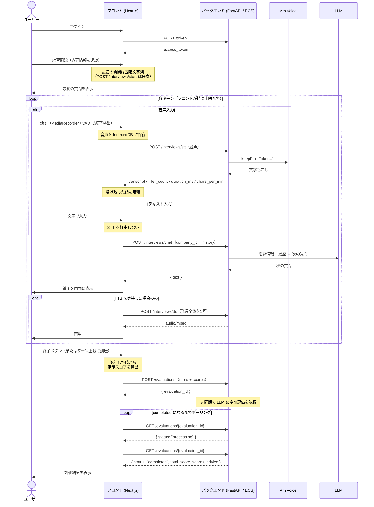
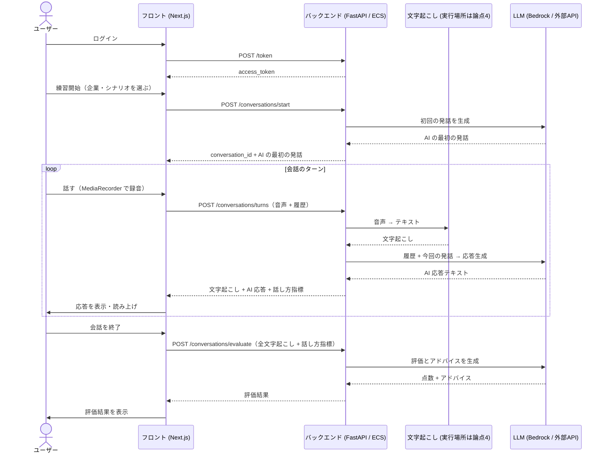
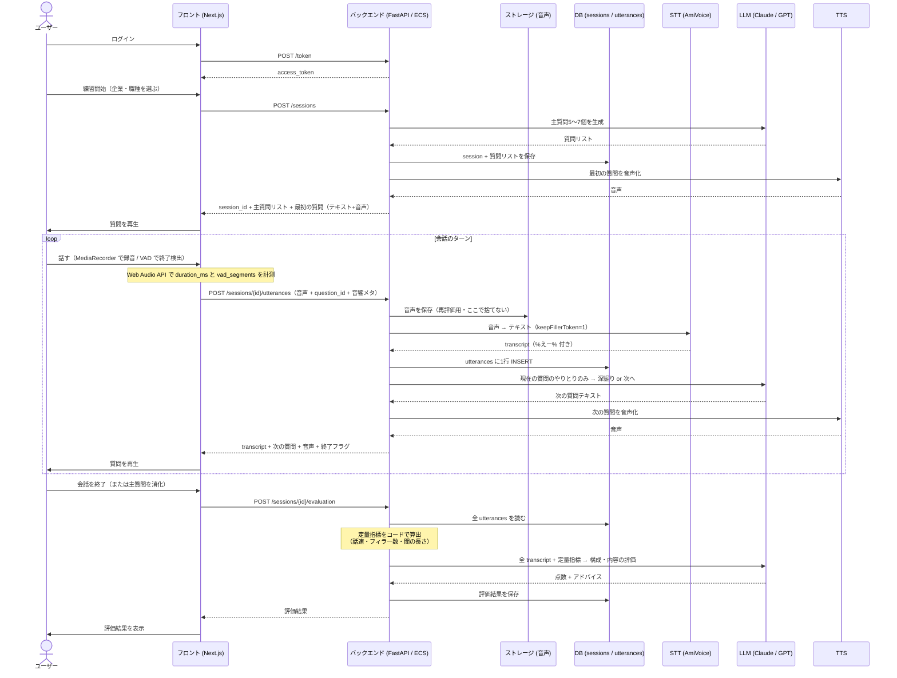
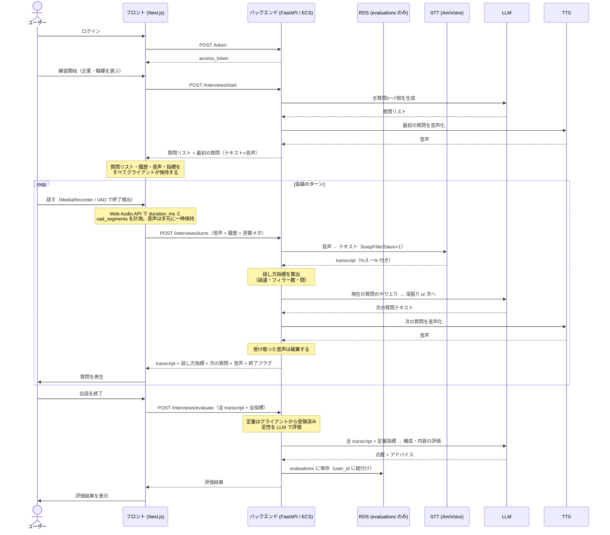

# 検討: 会話セッションのAPI構成

- ステータス: **結論**（API の骨格は確定。実装時に詰める項目が残る — 「1.4 残された論点」参照）
- 区分: **必須**（[#15 会話機能の方式決定](https://github.com/study-basic-hackathon/hanasu/issues/15) の前提。会話用 API の実装・会話画面の実装・[#29 Chime SDK基盤](https://github.com/study-basic-hackathon/hanasu/issues/29) の要否がすべてこの結論に依存し、後から音声の送信方式を変えるとフロント・バック・インフラの三方をやり直すことになる）
- 開始日: 2026-08-16
- 最終更新: 2026-08-16
- 関連: [#34](https://github.com/study-basic-hackathon/hanasu/issues/34)（本検討の Issue）、[#15 会話機能の方式を決定する](https://github.com/study-basic-hackathon/hanasu/issues/15)（後段。最終決定と ADR はここで行う）、[#29 Chime SDK基盤の構築](https://github.com/study-basic-hackathon/hanasu/issues/29)、[#28 Bedrock連携基盤の構築](https://github.com/study-basic-hackathon/hanasu/issues/28)、[#8 RDS構築](https://github.com/study-basic-hackathon/hanasu/issues/8)、[#11 企業情報登録API](https://github.com/study-basic-hackathon/hanasu/issues/11)、[必要api .md](../必要api%20.md)、[技術スタック.md](../技術スタック.md)

---

## 1. 結論

**最終的な構成 = API 7本（うち2本は任意）+ テーブル2つ。サーバーは会話状態を持たず、定量評価はフロントが算出する。**

**半構造化（主質問リスト・深掘り管理・質問単位の評価）は今回見送り、拡張として残す**（2.5 参照）。案の全体像は「2. 案の整理」、そこに至る議論は「3. ディスカッション」を参照。

### 1.1 決定事項

| # | 項目 | 決定内容 |
|---|---|---|
| 1 | **会話相手** | **AI**（2026-08-15 チーム決定） |
| 2 | **サーバーの状態保持** | **持たない（ステートレス）。** 会話履歴・音声はクライアントが保持し、毎回サーバーへ送る |
| 3 | **サーバー実装** | **既存の `backend/`（Python / FastAPI / ECS）を使う。** [#5 ECS構築](https://github.com/study-basic-hackathon/hanasu/issues/5)・[#7 認証API](https://github.com/study-basic-hackathon/hanasu/issues/7) の成果を活かす |
| 4 | **認証** | **JWT Bearer**（実装済みの `Depends(get_current_user)`）。**ただし今回ユーザーは1つしか用意しないため、評価結果テーブルに `user_id` は持たせない** |
| 5 | **API の本数** | **7本**（うち `start` と `tts` は任意） |
| 6 | **面接の進行** | **自由会話。** 会話履歴だけを見て次の質問を生成する。**半構造化は今回見送る**（`question_id` / 質問リスト / 深掘り上限 / 進行判断フラグはいずれも持たない） |
| 7 | **終了判定** | **ユーザーの終了操作のみ。** API に終了フラグは持たせず、**フロント側でターン数の上限を設けて打ち切る** |
| 8 | **最初の質問** | **当面はフロントに固定文字列を持つ。** `POST /interviews/start` は**優先度低（任意）** |
| 9 | **音声の取得** | **ブラウザの MediaRecorder**（Chime SDK は使わない） |
| 10 | **発話終了の検出** | **VAD（閾値 2〜3秒）+ 手動停止ボタンの併用。** 面接練習は考え込む間が長いため、一般的な 800ms では途中で切れる。自動停止の実装自体は優先度低 |
| 11 | **音声の保存** | **クライアントの IndexedDB に保持。サーバーは処理後に破棄し、永続化しない。** [技術スタック.md](../技術スタック.md) の「S3 は使わない」前提を維持できる |
| 12 | **文字起こし** | **AmiVoice が第一候補**（`keepFillerToken=1` でフィラーが `%えー%` 形式で返る）。**`raw_transcript` を絶対に捨てない。** フィラー抽出の精度は**実装して確かめてから判断する** |
| 13 | **評価指標** | **①話の速さ ②フィラーの数 ③構成・内容**（+ **④間の長さは「できたら」**）。**「抑揚」「声の大きさ」は採らない** |
| 14 | **話速の算出** | **文字数 ÷ 発話時間。** 形態素解析（モーラ数）は使わない。**`/interviews/stt` が算出して返す** |
| 15 | **定量スコアの算出** | **フロントが算出**して `POST /evaluations` に渡す。**DB に保存するだけで LLM には渡さない** |
| 16 | **定性評価** | **LLM は `turns`（会話履歴）だけを見て評価する。** 数値は渡さない |
| 17 | **評価の実行方式** | **非同期。** `POST /evaluations` は `evaluation_id` だけを返し、`GET /evaluations/{id}` でポーリングして結果を取る |
| 18 | **評価の状態** | `processing` / `completed` / **`failed`**（失敗を表現しないと永久にポーリングし続ける） |
| 19 | **`/interviews/chat` の返し方** | **ストリーミングしない。`{ "text": "..." }` を1回の JSON で返す。** SSE は実装しない |
| 20 | **TTS** | **必須ではない。余裕があれば作る。** 実装する場合も**発言全体を1回で音声化する**。**「句読点が来たタイミングで TTS に投げる」方式は実装しない** |
| 21 | **DB** | **応募情報テーブル / 評価結果テーブル**の2つ（+ 実装済みの `users`）。**会話履歴・音声・transcript は保存しない** |
| 22 | **評価結果の PK** | **`evaluation_id` 単体（サロゲートキー）。** `company_id` は FK + INDEX。**`session_id` はサーバー側では持たない**（`evaluation_id` と 1:1 で重複するため） |
| 23 | **Chime SDK** | **v1 では使わない。** 1対1かつ相手が AI のため代替不能な機能がなく、面接官 AI をアテンディーとして参加させるにはヘッドレスクライアントの常駐が必要になる |
| 24 | **Realtime API** | **v1 では使わない。** 音声はテキストの約10倍のトークンを消費し、32,768 トークン窓では15〜20分で上限に達しうる |

### 1.2 API のフロー



**テキストで表すと次の流れになる。**

```
[開始]
 └ 最初の質問を画面に表示（固定文字列）
    ※ POST /interviews/start を作る場合はここで呼ぶ
    getUserMedia でマイク権限を取得

[各ターンのループ] ← フロントがターン数の上限を持つ
 ├ 録音                     → API 呼び出しなし（ブラウザ内で完結）
 ├ POST /interviews/stt     → transcript + filler_count + duration_ms + chars_per_min
 │                            ※ テキスト入力のターンはスキップ
 ├ POST /interviews/chat    → 次の質問（1回の JSON）
 ├ 質問を画面に表示
 │  └ POST /interviews/tts  → 音声化して再生（※ TTS を実装した場合のみ）
 └ 蓄積: 会話履歴 + 定量指標の材料 + 音声（IndexedDB）

[終了] ← ユーザーの終了ボタン / フロントのターン上限
 ├ フロントで定量スコアを算出
 ├ POST /evaluations              → evaluation_id
 └ GET /evaluations/{id} をポーリング → completed になったらレポートを表示

[履歴]
 ├ GET /evaluations?company_id=12 → 一覧
 └ GET /evaluations/{id}          → 詳細（上と同じ API）
```

**フロー上の要点**

- **`/interviews/stt` は毎ターン呼ばれるとは限らない。** テキスト入力のターンは STT を経由せず `/interviews/chat` に直接届く
- **`/interviews/chat` はストリーミングしない。** 1回の JSON で次の質問が返る
- **`/interviews/tts` は任意。** 落としても、面接官の発言を文字表示するだけでチャットは成立する
- **録音中は API を呼ばない。** VAD・音響計測・音声保存はすべてブラウザ内で完結する
- **評価は非同期。** `POST /evaluations` は ID だけ返し、結果は `GET` でポーリングして取る
- サーバーは1リクエストを処理し終えたら何も覚えていない。**「会話の記憶」はクライアントが持つ**

### 1.3 API のインプットとアウトプット

**共通**: すべての API に `Authorization: Bearer <access_token>` を付ける（`Depends(get_current_user)` で検証）。

| # | エンドポイント | 役割 | 優先度 |
|---|---|---|---|
| 0 | `POST /token`（**実装済み**） | 認証 | — |
| 1 | `POST /interviews/start` | 最初の質問を生成 | **任意（低）** |
| 2 | `POST /interviews/stt` | 文字起こし + フィラー + 話速 | **最優先** |
| 3 | `POST /interviews/chat` | 次の質問を生成 | 高 |
| 4 | `POST /interviews/tts` | 発言の音声化 | **任意** |
| 5 | `POST /evaluations` | 評価の実行（非同期） | 高 |
| 6 | `GET /evaluations/{evaluation_id}` | 評価結果の取得 | 高 |
| 7 | `GET /evaluations?company_id={id}` | 評価履歴の一覧 | 中 |

**パス命名は未決** — 既存 API が `/token` / `/users/me` とプレフィックスなしのため、実装時に揃える。

#### 1. `POST /interviews/start` — 最初の質問（**任意・優先度低**）

```json
// リクエスト
{ "company_id": 12 }
```

```json
// レスポンス
{ "first_question": "本日はよろしくお願いします。まず自己紹介をお願いします。" }
```

- 企業情報・志望動機・経歴は **`company_id` からサーバーが読む**（登録済みのため送り直さない）
- **当面はフロントに固定文字列を持てばよく、この API は作らなくても成立する**

#### 2. `POST /interviews/stt` — 文字起こし（**実装最優先**）

```
Content-Type: multipart/form-data
audio: <録音した音声 (webm/opus)>
```

```json
// レスポンス
{
  "raw_transcript": "%えー% 私は前職で %あの% チームリーダーを...",
  "clean_transcript": "私は前職でチームリーダーを...",
  "filler_count": 2,
  "duration_ms": 19000,
  "chars": 88,
  "chars_per_min": 278
}
```

- AmiVoice に **`keepFillerToken=1` を必ず付与**する
- **`raw_transcript` を絶対に捨てない。** ここで整形すると評価が機能しなくなる。`clean_transcript` は**画面表示専用**で、LLM に渡すのは raw
- **音声の長さはサーバー側で取れるため、`duration_ms` / `chars` / `chars_per_min` まで算出して返す。** フロントは受け取った値を蓄積するだけでよい
- **フィラーが `%` 付きで返ることを単体で検証してから他に着手する**

#### 3. `POST /interviews/chat` — 次の質問

```json
// リクエスト
{
  "company_id": 12,
  "history": [
    { "role": "assistant", "content": "まず自己紹介をお願いします" },
    { "role": "user",      "content": "%えー% 田中と申します。前職では..." }
  ]
}
```

```json
// レスポンス
{ "text": "前職ではどのような役割を担っていましたか？" }
```

- サーバーは `company_id` から応募情報（企業情報・志望動機・経歴）を読み、system プロンプトに反映する
- **ストリーミングしない**（論点28）
- **終了フラグは持たない**（決定事項7）。**ターン数の上限はフロント側で管理する**
- **音声入力とテキスト入力の両方を受ける。** テキスト入力のターンは `/interviews/stt` を経由せず、この API に直接届く
- LLM に渡す履歴の範囲は**フロントの裁量**（論点20 保留）

#### 4. `POST /interviews/tts` — 音声化（**任意**）

```json
// リクエスト
{ "text": "前職ではどのような役割を担っていましたか？" }
```

レスポンス: **`audio/mpeg`（バイナリ）**

- 完全ステートレス。**発言全体を1回で音声化する**
- **「句読点が来たタイミングで TTS に投げる」方式は実装しない**（決定事項20）
- **この API を作らない場合は、面接官の発言をチャット画面に文字列で表示するだけでよい**

#### 5. `POST /evaluations` — 評価の実行（**非同期**）

```json
// リクエスト
{
  "company_id": 12,
  "turns": [
    { "role": "assistant", "content": "まず自己紹介をお願いします" },
    { "role": "user",      "content": "%えー% 田中と申します。前職では..." }
  ],
  "scores": {
    "speaking_speed": { "score": 80, "value": 284, "unit": "文字/分" },
    "filler":         { "score": 55, "value": 14,  "unit": "回" }
  }
}
```

```json
// レスポンス
{ "evaluation_id": 87 }
```

- **`turns` は `role` / `content` のみ。** 定量指標は含めない
- **`scores` はフロントが算出済みのものを受け取り、DB に保存するだけ。LLM には渡さない**
- **LLM は `turns` だけを見て定性評価（構成・内容）を行う**
- レスポンスは **`evaluation_id` のみ**。評価処理は非同期で走る

> **注意**: `score`（80点・55点）は計測値ではなく**評価値**であり、「284文字/分は何点か」という基準が要る。この構成では**その基準はフロント側に置かれる**（1.4 の「評価の点数化ロジック」のうち、定量部分はフロントの担当になる）。

#### 6. `GET /evaluations/{evaluation_id}` — 評価結果の取得

```json
// 処理中
{ "evaluation_id": 87, "status": "processing" }
```

```json
// 完了
{
  "evaluation_id": 87,
  "company_id": 12,
  "status": "completed",
  "created_at": "2026-08-16T14:32:00Z",
  "total_score": 72,
  "scores": {
    "speaking_speed":    { "score": 80, "value": 284, "unit": "文字/分" },
    "filler":            { "score": 55, "value": 14,  "unit": "回" },
    "structure_content": { "score": 72, "comment": "結論が後半に来る回答が目立つ。具体例は良い" }
  },
  "advice": ["「結論 → 理由 → 具体例」の順で話すと伝わりやすくなります"]
}
```

```json
// 失敗
{ "evaluation_id": 87, "status": "failed", "error": "LLM 呼び出しに失敗しました" }
```

- **`speaking_speed` / `filler` は 5番の入力をそのまま返す**（フロントが計算した値を保存しているため）
- `structure_content` と `advice` が LLM の出力
- **`failed` を用意しないと、LLM が落ちたときフロントが永久にポーリングし続ける**
- **評価結果の「詳細取得」もこの API を使う**（当初あった「評価結果詳細取得API」は重複のため統合）

#### 7. `GET /evaluations?company_id={id}` — 評価履歴の一覧

```json
// レスポンス
{
  "evaluations": [
    { "evaluation_id": 87, "created_at": "2026-08-16T14:32:00Z", "status": "completed", "total_score": 72 },
    { "evaluation_id": 64, "created_at": "2026-08-14T10:05:00Z", "status": "completed", "total_score": 65 }
  ]
}
```

- 一覧に `evaluation_id` を含めることで、**一覧 → 詳細（6番）の導線がつながる**

#### テーブル定義

```
users（実装済み）        applications（応募情報）      evaluations（評価結果）
─────────────           ──────────────────           ──────────────────
id            PK        id             PK            evaluation_id  PK
username                company_name                 company_id     FK + INDEX
password_hash           company_info   企業情報        status         processing/completed/failed
created_at              motivation     志望動機        total_score
                        resume         経歴           scores         JSON
                        created_at                    advice         JSON
                                                      created_at
```

| 判断 | 内容 |
|---|---|
| **`evaluations` の PK は `evaluation_id` 単体** | `GET /evaluations/{evaluation_id}` で引く以上、**これ単体で一意に特定できる必要がある**。(company_id, evaluation_id) の複合PKにすると取得時に company_id も必要になり、API を統合した意味が薄れる |
| **`session_id` は持たない** | 1セッション = 1評価なので `evaluation_id` と 1:1 になり、**概念が重複する**。クライアントが IndexedDB の音声を束ねる ID として内部的に持つのは自由 |
| **`user_id` は持たない** | **今回ユーザーを1つしか用意しないため**（2026-08-16 判断）。複数ユーザーに広げる場合は `evaluations` と `applications` の両方に追加し、取得系を JWT のユーザーで絞る必要がある |
| **`applications` は実態が「応募情報」** | 企業情報だけでなく**志望動機・経歴（ユーザー側の情報）を持つ**ため。API のフィールド名は `company_id` としているが、`application_id` に揃えるかは実装時に決めてよい |
| **会話履歴・音声・transcript は保存しない** | 決定事項21。過去セッションの再評価は今回の対象外 |

### 1.4 残された論点

**いずれも API の骨格を変えないため、この形のまま実装に進める。**

#### バックエンド実装時に検討する（保留）

| 論点 | 内容 | 備考 |
|---|---|---|
| **評価の点数化ロジック** | 「284文字/分は何点か」「フィラー14回は何点か」の基準、および `structure_content` を LLM にどう評価させるか | **定量部分はフロント、定性部分はサーバー（プロンプト設計）**に分かれる。API の形は変わらない |
| **STT の実行場所** | AmiVoice（第一候補）/ その他 | **外部 API の利用可否は確認済み（使用可能）** のため、AmiVoice を前提に進められる。**API の境界（音声を送る → テキストが返る）は不変**のため後から差し替えも可能 |
| **LLM の基盤** | 外部 API（Claude・GPT）/ Bedrock | **外部 API が使えるようになったため、どちらでも成立する。** Bedrock を採る場合は [#28](https://github.com/study-basic-hackathon/hanasu/issues/28) で **ECS タスクロールの新設**が必要 |
| **フィラー抽出の実現性と定義範囲** | `keepFillerToken=1` が期待どおり効くか。「なんか」「まあ」等を含めるか | **実装して確かめてから判断する**（決定事項12） |
| **パスの命名 / ID の命名** | `/interviews/*` に揃えるか。`company_id` を `application_id` に改名するか | 既存 API が `/token` `/users/me` とプレフィックスなしのため |
| **非同期処理の実装方式** | FastAPI の `BackgroundTasks` / ワーカー分離 / ポーリング間隔 | ECS タスクが1つのため、まずは `BackgroundTasks` で足りる見込み |

#### 保留（別議題）

| 論点 | 内容 |
|---|---|
| **LLM に渡す履歴の範囲** | 全量 / 直近 N ターン。**API 仕様にもサーバー実装にも影響せず、フロント側だけで切り替えられる** |
| **リロードで会話が消える問題** | クライアントが履歴を持つ設計の帰結。IndexedDB への保存で軽減できる |
| **「間の長さ」の評価** | 優先度「できたら」。実装する場合は VAD の区間記録から算出し、`scores` に `pause` を足す |

#### チームに確認が要るもの

#### ✅ 確認済み（2026-08-16）

| 確認内容 | 結果 |
|---|---|
| **外部の有償 API（AmiVoice / OpenAI 等）を使ってよいか** | **使用可能**。→ **AmiVoice による `keepFillerToken` を前提にできる**ため、フィラー計測の実現方法を再検討するリスクが消えた |
| **[#29 Chime SDK基盤](https://github.com/study-basic-hackathon/hanasu/issues/29) を今回不要としてよいか** | **不要で合意。** → Chime SDK 不採用が確定した |

#### 未確認

| 確認相手 | 確認内容 | なぜ効くか |
|---|---|---|
| **TAKUO2000** | [#28 Bedrock連携基盤](https://github.com/study-basic-hackathon/hanasu/issues/28) の着手状況と、**ECS タスクロールの新設が含まれるか**。**外部 LLM API が使えるようになったため、Bedrock を使うかどうか自体が論点になる** | LLM の基盤をどちらに寄せるかが決まる |
| [#8](https://github.com/study-basic-hackathon/hanasu/issues/8) 担当 | **[#8 RDS構築](https://github.com/study-basic-hackathon/hanasu/issues/8) の着手時期** | **`applications` と `evaluations` の2テーブルが必要**。会話機能そのものは RDS なしでも動く |
| フロント担当 | 録音・VAD・IndexedDB・**定量スコアの算出**・**ターン数上限の管理**がフロント側の実装範囲になること | 責務の分担。**点数化の基準（定量部分）もフロントに置かれる** |

#### ドキュメントの更新が必要なもの

- **[必要api .md](../必要api%20.md)** — 「会話用API: TODO：調べる」を本結論で埋める。また「音声分析: 抑揚・フィーラー・声の大きさ・スピード」は**抑揚と声の大きさが落ちる**ため実態と合わなくなる（[#34](https://github.com/study-basic-hackathon/hanasu/issues/34) の完了条件）

## 2. 案の整理

本検討で挙がった案の全体像。**採用したのは F案（ベース）+ E案のサーバー実装・認証 + パターン2**。

### 2.1 API 構成の案（A案〜F案）

| 案 | 出所 | 内容 | 結末 |
|---|---|---|---|
| **A案** | 本検討・第2ラウンド | ターンごとに音声を送信。DB もセッション管理も持たない最小構成。**自由会話が前提** | **不採用** — D案の提示により上書き |
| **B案** | 本検討・第2ラウンド | 音声はブラウザが保持し、終了時に一括送信。会話中はブラウザ側で文字起こし | **不採用** — **会話中の文字起こしがブラウザ依存**になり、精度と対応ブラウザが読めない |
| **C案** | 本検討・第2ラウンド | サーバーが `session_id` を発行し、会話履歴を RDS に保存 | **不採用** — 未構築の RDS が前提になる |
| **D案** | 外部の設計検討メモ・第3ラウンド | **会話系と評価系を分離。** 音声と transcript を保存し、評価ロジック改善時に**過去セッションを再評価できる**ようにする | **簡略化** — 再評価の優先度が低いため E案へ |
| **E案** | 本検討・第4ラウンド | D案から音声・transcript の保存を外した**ハッカソン簡略版**。4本構成（`start` / `turns` / `evaluate` / `evaluations`） | **F案に統合** — サーバー実装と認証の方針だけが引き継がれた |
| **F案** | 外部の API 設計ドキュメント・第10ラウンド | **5本構成**（`start` / `stt` / `chat` / `tts` / `evaluate`）。定量指標はクライアント算出。Next.js API Routes 前提 | **採用（ベース）** |

### 2.2 セッション状態の持ち方（パターン1 / パターン2）

| パターン | 内容 | 結末 |
|---|---|---|
| パターン1 | **サーバーが会話履歴を保持する。** クライアントは `session_id` だけ送り、サーバーが DB から読む | **不採用** — D案がこれを選んだ理由は「評価系が同じ DB を読むから」だったが、**音声も transcript も保存しない方針により、その理由が消滅した** |
| **パターン2** | **サーバーは会話状態を持たない。** 履歴はクライアントが保持し毎回送る | **採用** — DB がなくても会話が成立するため、**[#8 RDS構築](https://github.com/study-basic-hackathon/hanasu/issues/8) の完了を待たずに実装・動作確認ができる** |

**混同しやすい点**: パターン1/2 の違いは「会話履歴を保存するかどうか」ではなく**「履歴の置き場所」**。パターン2でも、届いた履歴を保存すれば記録として残せる。逆にパターン1は、処理のために DB を読む以上、記録が必然的に残る。

### 2.3 E案と F案の相違5点の決着

| # | 論点 | E案 | F案 | **採用** |
|---|---|---|---|---|
| 1 | サーバー実装 | 既存 `backend/`（FastAPI / ECS） | Next.js API Routes のみ | **E案** |
| 2 | 認証 | JWT Bearer | 認証なし | **E案** |
| 3 | 企業情報 | `company_id` で RDS 参照 | 文字列で直接渡す | **保留**（実装時） |
| 4 | 定量指標の算出場所 | サーバー | クライアント | **F案** |
| 5 | API の分割粒度 | 4本（`turns` に統合） | 5本（`stt` / `chat` / `tts` を分離） | **F案** |

### 2.4 検討したうえで採用しなかった技術

| 技術 | 判断 | 理由 |
|---|---|---|
| **Amazon Chime SDK** | 見送り | 多人数会議向けでオーバースペック。**AI を参加者にするためのサーバー常駐プロセスが必要**になり、HTTP POST 1本で済む処理が WebRTC トラック操作に置き換わる。エコーキャンセル等は `getUserMedia` のオプションで代替可。**将来「グループディスカッション練習」「人間の面接官 × AI 評価」に拡張するなら有力** |
| **OpenAI Realtime API** | 見送り | コンテキスト 32,768 トークン上限に対し、**音声はテキストの約10倍のトークンを消費**するため 15〜20分で上限に達しうる。生音声と解析データの取り出しも難しく、**会話系と評価系の分離が崩れる** |
| **Amazon Transcribe** | 見送り | **`keepFillerToken` 相当の機能がない。** フィラー計測が中核である以上、寄せられない |
| **モーラ数による話速算出**（kuromoji.js / Sudachi） | 不採用 | **文字数 ÷ 発話秒数で足りる**との判断。形態素解析がサーバー・クライアントのいずれからも不要になり、**ECS のメモリ（512MB）を圧迫する懸念も消えた** |
| **質問の完全動的生成** | 不採用 | 深掘りは自然になるが、**カバレッジ非保証・終了判定が不安定・評価が構造を失う。** デモ時に進行を強制できない点が致命的 |
| **抑揚（ピッチ）の評価** | 見送り | ピッチ抽出のライブラリが必要で、ECS（CPU 256 / メモリ 512MB）では負荷が厳しく、**良し悪しの判定基準を作るのも難しい** |

### 2.5 今回は見送り、拡張として残すもの

**まずシンプルに実装し、動くことを確認してから拡張する**という方針（2026-08-16 ユーザー判断）。

| 項目 | 内容 | 見送りの理由 |
|---|---|---|
| **半構造化面接** | 主質問5〜7個を事前生成し、`question_id` で紐付け、深掘り回数を管理する | **まず自由会話で成立することを確認する。** これが終わった後の拡張検討として残す |
| **質問単位の評価**（`per_question`） | 質問ごとにスコアとコメントを出す | 半構造化が前提。**今回はセッション全体で1つの評価** |
| **進行判断フラグ**（`deepen` / `next_question` / `end_interview`） | LLM が深掘りか次へかを判断して返す | 同上。**終了はユーザー操作 + フロント側のターン数上限で足りる** |
| **`intent`（質問の狙い）** | 会話制御・進捗UI・評価軸の3箇所で使い回す | 半構造化が前提 |
| **`profile_summary`** | 経歴の要約を作り、固定文字列として使い回してプロンプトキャッシュを効かせる | 応募情報テーブルに経歴を持つため、`company_id` から都度読めば足りる |
| **過去セッションの再評価** | 音声と transcript を保存し、評価ロジック改善時に再評価する | **優先度低**。音声も transcript も保存しない |
| **`evidence` による音声再生** | 評価画面から該当箇所を聞き返す | **優先度低**（追加実装扱い） |
| **モックモード** | 録音済み音声 + 固定 transcript で動かすトグル | **「実装できたら」** |
| **「間の長さ」の評価** | VAD の区間記録から算出し、`scores` に `pause` を足す | **「できたら」** |
| **`POST /interviews/start`** | 最初の質問を LLM で生成する | **当面はフロントに固定文字列を持つ**ため任意 |
| **`POST /interviews/tts`** | 発言の音声化 | **必須ではない。** 文字表示だけでチャットは成立する |
| **ストリーミング（SSE）** | `chat` の応答を逐次返す | **TTS を句読点単位で投げる方式を採らないため、採用する理由が消えた** |

---

## 3. ディスカッション

以下は結論に至るまでの議論の記録。**節番号（5.1〜5.14）は議論が進んだ順のまま残している。**

## 3.1 背景・きっかけ

会話セッションの開始から終了までに必要な API が未定義で、[必要api .md](../必要api%20.md) の「会話用API」は `TODO：調べる` のまま。会話画面（[#27](https://github.com/study-basic-hackathon/hanasu/issues/27) / [#9](https://github.com/study-basic-hackathon/hanasu/issues/9)）もバックエンド実装も着手できない。

2026-08-15 に一度検討を行ったが、**2026-08-16 にユーザーの判断で白紙に戻して検討し直すことになった**（前回の検討記録は削除済み。[#15](https://github.com/study-basic-hackathon/hanasu/issues/15) 本文に残る暫定決定7項目も、本検討では前提として引き継がない）。

### 検討の前提（ユーザー確認済み・2026-08-16）

| 前提 | 内容 |
|---|---|
| 会話相手 | **AI**（2026-08-15 チーム決定） |
| **最優先の評価軸** | **ハッカソン期間内に動くこと** — 実装量の少なさ、既存実装（FastAPI + JWT）への乗せやすさを最優先し、インフラの新規構築が必要な案は下げる |
| 検討の範囲 | セッション開始 〜 終了して評価が返るまでに必要な API の洗い出しと、その利用フロー |
| 決定の場 | 本検討は候補比較と推奨案まで。**最終決定と ADR は [#15](https://github.com/study-basic-hackathon/hanasu/issues/15)** |

## 3.2 論点一覧

会話セッションの流れ（開始 → 発話 → AI 応答 → 繰り返し → 終了 → 分析 → 評価）に沿って洗い出す。

| # | 論点 | D案（外部検討案）の方針 | **E案（2026-08-16 ユーザー方針）** |
|---|---|---|---|
| 1 | **セッション開始 API を設けるか**（= サーバーがセッション状態を持つか） | 設ける（`POST /sessions` で主質問も生成） | **設けるが状態は持たない** — 質問リストを返すだけ |
| 2 | **音声取得方式** — ブラウザの MediaRecorder か、Chime SDK か | MediaRecorder（Chime SDK は v1 不要と結論） | 同左 |
| 3 | **音声をいつ・どの単位で送るか** — ターンごと / 終了時に一括 / ストリーミング | ターンごと | 同左 |
| 4 | **文字起こしの実行場所** — ECS 上のセルフホスト（Whisper）/ マネージド（Transcribe 等）/ 外部 API | 外部 API（AmiVoice が第一候補）— フィラー計測が決め手 | 同左（**未決 — 外部 API の利用可否待ち**） |
| 5 | **AI 応答の生成基盤** — Bedrock / 外部 LLM API | Claude / GPT の chat API | 同左（**未決 — [#28](https://github.com/study-basic-hackathon/hanasu/issues/28) との整合待ち**） |
| 6 | **AI 応答の返し方** — テキストのみ（ブラウザで読み上げ）/ サーバー側 TTS で音声 | サーバー側 TTS（OpenAI TTS / VOICEVOX） | 同左 |
| 7 | **会話履歴の保持場所** — クライアント / サーバーメモリ / RDS | DB（sessions / utterances） | **クライアント**（DB に残さない） |
| 8 | **話し方分析のタイミング** — ターンごと / 終了後にまとめて | 終了後にまとめて（音声を保存するため可能） | **ターンごと**（音声を保持しないため。指標はクライアントが蓄積） |
| 9 | **音声データを保存するか** — [技術スタック.md](../技術スタック.md) の「S3 は使わない」前提を維持するか | 必ず保存する（前提と衝突） | **保存しない。ブラウザの一時保持のみ**（**前提を維持できる**） |
| 10 | **評価 API の入出力** — 文字起こし + 話し方情報 → 点数 + アドバイス | 入力は `session_id` のみ | **入力は全 transcript + 全指標**。結果のみ DB に残す |
| 11 | **API 一覧と利用フロー** | 5.7 / 5.8 に整理 | **5.10 に整理（現時点の最新案）** |
| 12 | **話速・間の計測を誰が行うか** — ブラウザ / サーバー | ブラウザ（Web Audio API + VAD） | **✅ クライアント算出で確定**（2026-08-16 最終）— **話速は「文字数 ÷ 発話秒数」。モーラ数（形態素解析）は使わない。** ブラウザは音響メタをサーバーに送らず、自分で算出して蓄積する。サーバーは STT の結果（transcript / フィラー）を返すだけ |
| 13 | **面接の進行を自由会話にするか半構造化にするか** | 半構造化（主質問5〜7個 + 深掘り判断） | **✅ 半構造化で確定**（2026-08-16 ユーザー判断） |
| 14 | **（新規）評価結果に会話のサマリを含めるか** — 履歴から会話を振り返れるようにするか | （音声・transcript が残るため論点にならない） | **✅ 含めない**（2026-08-16 ユーザー判断） |
| 15 | **（新規）音響メタをどの粒度で送るか** — VAD の区間配列 / 集計値のみ | 区間配列を `utterances` に保存（再計算のため） | **✅ 確定**（2026-08-16）— **必須は `speech_ms`、任意で `silence_ms` / `longest_pause_ms`**（「間」の評価用）。区間配列と `volume_*` は不要 |
| 16 | **（新規）`question_id` は必要か** | 必要（評価を質問単位で構造化するため） | **✅ 必要**（論点13 の確定により連鎖して決定） |
| 17 | **（新規）開始 API は必要か** — 「ユーザーの発話がない第一声」をどう作るか | 必要（`POST /sessions` で主質問生成 + 状態作成） | **✅ 必要**（質問リストの生成 + 第一声。状態は持たない） |
| 18 | **（新規）質問リストを誰がいつ作るか** — LLM 生成 / 事前登録 / ハイブリッド | セッション開始時に一括生成、または事前用意 | **✅ フォールバック方式で確定**（2026-08-16）— **基本は開始 API で企業情報とともに LLM に投げて生成し、生成に失敗した場合は事前登録の質問を使う** |
| 19 | **（新規）深掘りの上限** | （明記なし） | **✅ 上限3回で確定**（2026-08-16）。設定値の置き場は API 側 / フロント側のどちらでもよく、**どちらかで設定できる形にする** |
| 21 | **（新規）終了条件** — 誰が「面接の終わり」を宣言するか | tool call で `end_interview`、または主質問の消化で終了 | **✅ 確定**（2026-08-16）— **①主質問の消化（サーバー判定）②ユーザーの終了操作** の2つを併用。**LLM の tool call は半構造化の採用により不要**、時間制限は設けない。**途中終了でもそこまでの内容で評価する**（最低ターン数なし） |
| 22 | **（新規）フォールバック用の質問をどこに持つか** — アプリ内の定数 / `companies` に紐づけて DB 登録 | （論点なし） | **✅ アプリ内の定数で確定**（2026-08-16）。`companies` テーブルの拡張が不要になる |
| 23 | **（新規）評価指標を何にするか** — 出典によって食い違っている。**論点15（音響メタの粒度）はこれに従属する** | 話速・文章構成・話の内容・フィラー数（メモ1章）。データモデルには「間」も含む（メモ4.5） | **✅ 確定**（2026-08-16）— 必須3つ **①話の速さ ②フィラーの数 ③構成・内容** + **④間の長さ（優先度「できたら」）**。**「抑揚」「声の大きさ」は採らない**（[必要api .md](../必要api%20.md) の更新は [#34](https://github.com/study-basic-hackathon/hanasu/issues/34) で行う） |
| 20 | **（新規）会話履歴をどの範囲で LLM に渡すか** — 現在の主質問のやりとりのみ / 面接全体 | 質問単位で切る（メモ 5.4 で採用） | **⏸ 保留**（2026-08-16 ユーザー判断）— **API 仕様にもサーバー実装にも影響しない。** パターン2ではサーバーは受け取った `history` をそのまま LLM に渡すだけで、切る処理はサーバー側に存在しないため、**フロント側の実装だけで切り替えられる** |

| 24 | **（新規）サーバー実装をどこに置くか** — 既存の `backend/`（FastAPI / ECS）/ Next.js API Routes | — | **✅ 既存の `backend/` で確定**（2026-08-16）。[#5](https://github.com/study-basic-hackathon/hanasu/issues/5)・[#7](https://github.com/study-basic-hackathon/hanasu/issues/7) の成果を活かす |
| 25 | **（新規）会話系 API に認証を課すか** | — | **✅ JWT Bearer を課す**（2026-08-16）。[必要api .md](../必要api%20.md) の制約を満たす |
| 26 | **（新規）企業情報をどう渡すか** — `company_id` で RDS 参照 / 文字列で直接渡す | — | **⏸ 保留**（2026-08-16）— **どちらもあり得る。バックエンド実装時に判断する** |
| 27 | **（新規）API の分割粒度** — 4本（`turns` に統合）/ 5本（`stt` / `chat` / `tts` を分離） | 5本 | **✅ 5本で確定**（2026-08-16）— 文字入力にも対応するため STT を分離、TTS は実装が間に合わない可能性があるため分離して開発を分ける |

| 28 | **（新規）`/interviews/chat` のレスポンスをストリーミングにするか** — SSE で `text` の `delta` を逐次返す / 1回の JSON で返す | ストリーミング（句点単位で TTS に投げるため） | **✅ ストリーミングしないで確定**（2026-08-16）— **1回の JSON で「発言テキスト + `action`」を返す。** あわせて**「句読点が来たタイミングで TTS に投げる」方式も実装しないことを明確に決定** |

> **⚠️ この論点表は議論の経緯を残したもの。** 2026-08-16 の最終判断により、**半構造化に関する論点13・16・17・18・19・21・28 は「今回は見送り、拡張として残す」に変わっている**（2.5 参照）。**現在の決定は「1.1 決定事項」を参照すること。**

**最終確定と ADR は [#15](https://github.com/study-basic-hackathon/hanasu/issues/15) で行う。**

## 3.3 事実確認（出典付き）

### バックエンドの実装状況

| 事実 | 出典 |
|---|---|
| Python `>=3.14` / FastAPI / SQLAlchemy / psycopg / PyJWT / uvicorn / python-multipart | `backend/pyproject.toml` |
| 認証は **JWT Bearer**。`POST /token`（ユーザー名 + パスワード → アクセストークン）と `GET /users/me` が実装済み | `backend/app/routers/auth.py` |
| 保護 API は `Depends(get_current_user)` で JWT を検証する形が確立済み | `backend/app/routers/auth.py` |
| **`python-multipart` が依存に入っている** = ファイルアップロード（`multipart/form-data`）を受ける下地はある | `backend/pyproject.toml` |
| DB は **PostgreSQL** 前提（`postgresql+psycopg://hanasu:hanasu@db:5432/hanasu`）。テーブルは起動時に `Base.metadata.create_all` で作成 | `backend/app/database.py`、`backend/app/main.py` |
| 現在のモデルは `users` のみ（`id` / `username` / `password_hash` / `created_at`） | `backend/app/models/users.py` |
| アクセストークンの有効期限は **60分** | `backend/app/security.py` |

### インフラの実装状況

| 事実 | 出典 |
|---|---|
| ECS Fargate タスクは **CPU 256 / メモリ 512MB**（最小構成） | `infra/dev/ecs.tf` |
| **ECS タスクロール（`task_role_arn`）が未設定**。存在するのは実行ロール（`ecs_task_execution`）のみ | `infra/dev/ecs.tf`、`infra/dev/iam.tf` |
| ALB → ECS（コンテナポート 8000）の HTTP 構成 | `infra/dev/alb.tf`、`infra/dev/locals.tf` |
| **RDS はまだ存在しない**（`infra/dev/` に RDS 定義なし）。[#8](https://github.com/study-basic-hackathon/hanasu/issues/8) は Open | `ls infra/dev`、`gh issue list` |
| Bedrock / Chime SDK の基盤も未構築（[#28](https://github.com/study-basic-hackathon/hanasu/issues/28) / [#29](https://github.com/study-basic-hackathon/hanasu/issues/29) は Open、担当は TAKUO2000） | `gh issue list` |

→ **アプリから AWS の API（Bedrock 等）を呼ぶには、ECS タスクロールの新設と権限付与が必要。** 現状の実行ロールは ECR pull とログ出力用であり、アプリ内からの AWS API 呼び出しには使えない（[#28](https://github.com/study-basic-hackathon/hanasu/issues/28) の範囲）。

→ **CPU 256 / メモリ 512MB は、ECS 上での Whisper セルフホストには足りない**見込み（論点4に直結。増強するならタスク定義の変更が要る）。

### 技術スタックの想定

| 事実 | 出典 |
|---|---|
| AWS Chime SDK・Bedrock を利用想定 | `技術スタック.md` |
| 音声認識は `open whisper？` と**疑問符付き**で、未確定 | `技術スタック.md` |
| **S3 は「現状想定では使わない」**（音声データの置き場として）。Terraform の state 管理用のみ利用 | `技術スタック.md` |
| RDS の格納対象は「企業情報・プロフィール」。**会話履歴・評価結果は挙がっていない** | `技術スタック.md` |
| バックエンドは Python / FastAPI、デプロイ先は ECS(Fargate) | `技術スタック.md` |

### 必要 API の既存の想定

| 事実 | 出典 |
|---|---|
| 認証 API / 企業情報 CRUD API / 音声認識 API（文字起こし + 抑揚・フィラー・声量・スピード）/ 内容評価 API（→ 点数 + アドバイス）/ **会話用 API（`TODO：調べる`）** の5つ | `必要api .md` |
| 制約: **認証ユーザーのみ実行可能** | `必要api .md` |

## 3.4 案の比較（議論の経緯順）

**比較軸は「既存実装への乗せやすさ」の1本**（2026-08-16 ユーザー確認）。実装量の見積もりは行わない。

### 5.1 論点1・3・7・8・9: セッションと音声の扱い（**本検討の中心**）

これら4論点は連動して API の形を決めるため、まとめて3案として比較する。

| 観点（既存実装への乗せやすさ） | **A案: ターンごとに音声を送る** | B案: 音声はブラウザが保持し終了時に一括 | C案: サーバーがセッション状態を持つ |
|---|---|---|---|
| 受け口の実装 | `multipart/form-data` を受けるだけ。**`python-multipart` が既に依存にある**（`backend/pyproject.toml`） | 同左（終了時に1回） | 同左 + セッション CRUD |
| DB | **不要**（`users` テーブルのみで足りる） | 不要 | **RDS が必要**（[#8](https://github.com/study-basic-hackathon/hanasu/issues/8) は Open、`infra/dev/` に定義なし） |
| 認証 | `Depends(get_current_user)` をそのまま付けるだけ | 同左 | 同左 |
| 会話中の文字起こし | **サーバー側で実行**（ターンごと） | **ブラウザ側に依存**（Web Speech API 等）。サーバーは終了時のみ | サーバー側で実行 |
| 話し方分析に使う音声 | ターンごとに届くため**その場で分析できる** | 終了時に全部届く | ターンごと |
| 既存 ECS への影響 | タスクの CPU/メモリは音声処理の実行場所次第（論点4） | 同左（ただし終了時に大きなファイルが1回） | 同左 |
| **総評** | **既存実装にそのまま乗る。DB もセッション管理も増やさない** | サーバーは最小だが、**会話中の文字起こしがブラウザ依存になり精度と対応ブラウザが読めない** | **RDS 構築が前提になり、未構築のインフラに依存する** |

→ **推奨は A案。** 既存の FastAPI + JWT + `python-multipart` にそのまま乗り、DB もセッション管理も増やさないため。

### 5.2 論点4（文字起こしの実行場所）は API の形を変えない

文字起こしを ECS 上のセルフホストで行うか、マネージドサービスに投げるか、外部 API を使うかは、**API の境界（音声を送る → テキストが返る）を変えない**。したがって本検討では**未決のまま進めてよく、後から差し替えられる**。

ただし ECS 上でのセルフホストを選ぶ場合は、**現在の CPU 256 / メモリ 512MB では足りない見込み**であり、タスク定義の変更が必要になる（`infra/dev/ecs.tf`）。

### 5.3 論点5・6: AI 応答の生成と返し方

| 論点 | 選択肢 | 既存実装への乗せやすさ |
|---|---|---|
| 5. 生成基盤 | Bedrock | **ECS タスクロールの新設が必要**（現状は実行ロールのみ）。[#28](https://github.com/study-basic-hackathon/hanasu/issues/28) の範囲 |
| 5. 生成基盤 | 外部 LLM API | API キーを環境変数で渡すだけ。ECS の IAM に手を入れない |
| 6. 返し方 | テキストのみ（ブラウザで読み上げ） | **サーバーに TTS を持たないため実装が増えない** |
| 6. 返し方 | サーバー側 TTS で音声を返す | 音声合成の実行場所と、応答サイズの扱いが増える |

→ 論点6 は**テキストのみ**が素直。論点5 は Bedrock / 外部 API のどちらでも API の形は変わらないため、[#28](https://github.com/study-basic-hackathon/hanasu/issues/28) の進捗と合わせて決めればよい。

### 5.4 A案での API 一覧（論点11）

| # | API | 入力 | 出力 | 呼び出し元 |
|---|---|---|---|---|
| 0 | `POST /token`（**実装済み**） | username, password | access_token | フロント |
| 1 | `POST /conversations/start` | 企業ID / シナリオ設定 | conversation_id、AI の最初の発話 | フロント |
| 2 | `POST /conversations/turns` | 音声ファイル（multipart）、会話履歴 | 文字起こし、AI 応答テキスト、話し方指標 | フロント |
| 3 | `POST /conversations/evaluate` | 全文字起こし、話し方指標 | 評価点数、アドバイス | フロント |

すべて `Depends(get_current_user)` で JWT を検証する（[必要api .md](../必要api%20.md) の「認証ユーザーのみ実行可能」制約）。

### 5.5 A案での利用フロー（論点11）



**このフローで未確定なもの**（フロー自体は変わらない）

- 論点4: `STT` を誰が実行するか（ECS 内 / マネージド / 外部 API）
- 論点5: `LLM` が Bedrock か外部 API か
- 話し方指標を**ターンごとに返す**か、**終了時にまとめて計算する**か（後者を採る場合、音声を保存しない前提だと終了時に音声を再送する必要がある）

### 5.6 外部で検討された設計案（D案）

出典: ユーザーが別途作成した「音声面接練習アプリ 設計検討メモ」（2026-08-16、ステータス: 壁打ち段階）。**提示時点で案であり決定ではない**（ユーザー明言）。用途は**面接・プレゼンの練習**、評価観点は**話速・文章構成・話の内容・フィラー数**。

| # | 方針 | 内容 |
|---|---|---|
| 1 | **会話系と評価系の分離**（設計の中核） | 録音音声を必ず保存し、会話系（STT → LLM → TTS）と評価系（音響指標の蓄積 → 終了時に LLM 評価）を独立させる。**評価ロジックを改善したとき過去セッションを再評価できる** |
| 2 | **定量はコード、定性は LLM** | 話速・フィラー数・間の長さはコードで機械的に算出。構成・内容・論理性は LLM。全部 LLM だと同じ会話でも点数がブレる |
| 3 | **STT は AmiVoice が第一候補** | `keepFillerToken=1` でフィラーが `%えー%` の形で返り、**正規表現で数えるだけでフィラー計測が完了する**。発話区間のみ課金。Amazon Transcribe に同等機能はない |
| 4 | **word timestamps は必須ではない** | 話速は「発話秒数（ブラウザの録音時間）+ 文字数」で足り、間は Web Audio API + VAD で自前計測する。**STT の選択肢が広がる** |
| 5 | **履歴は DB の session テーブルに持つ** | クライアント保持ではリロードで消え、評価系も同じデータを読むため結局サーバーに必要 |
| 6 | **発話終了は VAD（閾値 2〜3秒）+ 手動停止ボタンの併用** | 面接練習は考え込む間が長い。VAD の無音区間データはそのまま「間の長さ」指標になる |
| 7 | **半構造化面接** | 主質問5〜7個を事前用意または開始時に一括生成。LLM は「深掘りか次へか」の判断と深掘り質問だけを担当。**評価が質問単位で構造化され比較可能になる** |
| 8 | **質問単位でコンテキストを切る** | 履歴長が1質問分（3〜4ターン）で頭打ちになり O(n²) 問題が消える。評価系は DB の全ターンを読むため品質は落ちない |
| 9 | **レイテンシ対策** | 直列だと5〜7秒の沈黙。①LLM をストリーミングし句点単位で TTS に流す ②録音停止と同時に STT ③相槌を事前生成してキャッシュ |
| 10 | **Realtime API は v1 見送り** | 音声はテキストの約10倍のトークンを消費し、32,768 トークン窓では15〜20分で上限に達しうる。将来のレイテンシ改善策として保留 |
| 11 | **Chime SDK は v1 不要** | 1対1かつ相手が AI のため代替不能な機能がない。**面接官 AI をアテンディーとして参加させるにはヘッドレスクライアントの常駐が要る**。グループディスカッション練習や「人間の面接官 × AI 評価」に拡張するなら有力 |
| 12 | データモデル | `utterances`（session_id / turn_index / question_id / audio_url / transcript / duration_ms / vad_segments / created_at）。**transcript はフィラー除去前の生テキストで保存する** |
| 13 | コスト | 1セッション数円〜十数円。**コストは設計上の制約にならない** |

### 5.7 D案での API 一覧（論点11）

メモには API 一覧そのものの記載がないため、**4章の基本ループと 4.5 のデータモデルから起こしたもの**。

| # | API | 入力 | 出力 | 備考 |
|---|---|---|---|---|
| 0 | `POST /token`（**実装済み**） | username, password | access_token | |
| 1 | `POST /sessions` | 面接設定（企業ID・職種・シナリオ等） | session_id、主質問リスト、最初の質問（テキスト + 音声） | 半構造化のため**ここで主質問5〜7個を生成する** |
| 2 | `POST /sessions/{id}/utterances` | 音声 blob、question_id、duration_ms、**vad_segments** | transcript（フィラートークン付き）、次の質問、TTS 音声、深掘り/次へ の判定、終了フラグ | **会話系の中核。1ターン = 1リクエスト** |
| 3 | `POST /sessions/{id}/evaluation` | session_id のみ | 評価点数、アドバイス | サーバーが `utterances` を読み、**定量はコード・定性は LLM** で算出 |
| 4 | `GET /sessions/{id}` | session_id | セッション情報 + これまでの `utterances` | **リロード復帰用。** 履歴をサーバーに持つ設計の帰結 |
| 5 | `GET /sessions/{id}/evaluation` | session_id | 評価結果 | 評価を非同期にする場合に必要。同期で返すなら不要 |

**API 設計上の注目点**

- **`vad_segments` と `duration_ms` はブラウザ側で計測してサーバーへ送る**（Web Audio API / MediaRecorder はブラウザの機能）。「定量はコード」の一部が**クライアント側の責務**になるため、API の入力仕様に直接効く
- `question_id` を入力に持つことで、評価が質問単位で切れる（方針7・8 の帰結）
- TTS 音声を**レスポンスに同梱するか URL で返すか**は未決。方針9 の「句点単位で TTS に流す」を採るなら、この API は **SSE / WebSocket** になる

### 5.8 D案での利用フロー（論点11）



### 5.9 A案（本検討の推奨）と D案（外部検討案）の差分

| 論点 | A案 | **D案** | 差分の意味 |
|---|---|---|---|
| 9. 音声の保存 | 保存しない | **必ず保存**（再評価のため） | **[技術スタック.md](../技術スタック.md) の「S3 は使わない」前提の見直しが要る** |
| 7. 履歴の保持 | クライアント | **DB（sessions / utterances）** | **[#8 RDS構築](https://github.com/study-basic-hackathon/hanasu/issues/8) が会話機能のブロッカーになる** |
| 1. セッション状態 | 持たない | **持つ** | API が `/sessions/{id}` 系になり、リロード復帰用の `GET` が要る |
| 6. AI 応答の返し方 | テキストのみ（ブラウザで読み上げ） | **サーバー側 TTS** | 音声を同梱するか URL で返すかの決定が要る |
| 4. STT | 実行場所は未決（API 境界は不変） | **AmiVoice が第一候補** | **フィラー計測が中核**という要件から逆算された選定。外部 API 前提 |
| 5. LLM | Bedrock / 外部 API どちらでも可 | **Claude / GPT の chat API** | **[#28 Bedrock連携基盤](https://github.com/study-basic-hackathon/hanasu/issues/28) の位置づけが変わる** |
| — 面接の進行 | 自由な会話 | **半構造化（主質問 + 深掘り判断）** | 評価が質問単位で構造化される。API に `question_id` が入る |
| 8. 分析タイミング | ターンごと | **終了時にまとめて**（音声が残っているため可能） | 評価 API の入力が `session_id` だけで済む |
| — 話速・間の計測 | 未検討 | **ブラウザ側で計測して送る** | API の入力に `duration_ms` / `vad_segments` が加わる |

→ **D案は評価の質と再現性で明確に優れる**（定量/定性の分離、音声保存による再評価、質問単位の構造化）。A案が優れるのは**「既存実装への乗せやすさ」の1点のみ**であり、しかもその優位は RDS・ストレージ・外部 API を使わないことに由来する。**D案を採る場合、[#8 RDS構築](https://github.com/study-basic-hackathon/hanasu/issues/8) とストレージの手当てが会話機能の前提条件になる。**

### 5.10 E案 = D案のハッカソン簡略版（**2026-08-16 ユーザー方針**）

D案に対し、ユーザーより次の方針が示された。

| # | 方針 | 出典 |
|---|---|---|
| 1 | **音声はブラウザ側の一時保存でよい**（サーバー・S3 に永続化しない） | 2026-08-16 ユーザー |
| 2 | **過去セッションの再評価は今回の実装優先度が高くない** | 同上 |
| 3 | **DB に残すのは評価結果くらい。** 音声データもトランスクリプトも残さない | 同上 |

#### この方針が設計に与える帰結

| 項目 | D案 | **E案** |
|---|---|---|
| 音声の置き場 | ストレージに永続化 | **ブラウザが一時保持。サーバーは受け取って処理したら破棄** |
| `utterances` テーブル | 必要 | **不要** |
| `sessions` テーブル | 必要 | **不要**（会話中の状態はクライアントが持つ） |
| DB に残すもの | 音声URL・transcript・音響メタ・評価 | **評価結果のみ** |
| transcript の保持 | DB | **クライアント**（サーバーがターンごとに返し、評価時にまとめて送り返す） |
| 評価 API の入力 | `session_id` のみ | **全 transcript + 全指標**（クライアントが蓄積したもの） |
| 再評価 | できる | **できない**（優先度低として許容） |
| リロード復帰 | できる（`GET /sessions/{id}`） | **できない**（会話が失われる） |

#### パターン1（状態あり）とパターン2（状態なし）の違いの正確な整理

**混同しやすい3つを分けて考える必要がある**（2026-08-16 の議論で明確化）。

| 何を | 用途 | パターン1 | パターン2 | 今回の方針 |
|---|---|---|---|---|
| **企業情報** | 質問生成に使う**マスタデータ** | RDS | **RDS（同じ）** | **必要**（[#11](https://github.com/study-basic-hackathon/hanasu/issues/11) の範囲。会話機能とは無関係に元々ある） |
| **会話履歴（処理用）** | 次の発話を生成するために必要 | **RDS に保存して読む** | **クライアントが毎回送る** | **パターン2** |
| **会話履歴（記録用）** | 後から会話を見返す | 上と兼用で**必然的に残る** | **任意**（届いた履歴を保存すれば残せる） | **残さない** |
| **評価結果** | 履歴画面・振り返り | RDS | **RDS（同じ）** | **残す** |

**2つの誤解を避ける**

1. **「パターン1 = 会話を保存する / パターン2 = 保存しない」ではない。** パターン2でも、届いた履歴を保存すれば記録は残せる。逆にパターン1は、処理のために DB を読む以上、記録が**必然的に**残る（分離できない）
2. **企業情報の DB は一時的なものではない。** 会話のために設けるのではなく、[#11 企業情報登録API](https://github.com/study-basic-hackathon/hanasu/issues/11) が管理する恒久的なマスタで、**パターン1でもパターン2でも同じように必要**

**本質的な違いは「サーバーが会話を継続するために DB に依存するか」**

| | DB がない状態で会話が成立するか |
|---|---|
| パターン1 | **成立しない**（履歴を読めないと次の発話を作れない） |
| パターン2 | **成立する**（クライアントが履歴を運ぶため） |

→ ハッカソンでの実務上の意味は、**パターン2なら [#8 RDS構築](https://github.com/study-basic-hackathon/hanasu/issues/8) の完了を待たずに会話機能を実装・動作確認できる**こと（企業情報を固定値で渡せば、RDS なしで会話が動く）。

#### E案で解消される衝突（**重要**）

| D案の衝突 | E案での状態 |
|---|---|
| [技術スタック.md](../技術スタック.md) の「S3 は使わない」 vs 音声を必ず保存 | **解消。** 音声を永続化しないため、S3 不使用の前提をそのまま維持できる |
| [#8 RDS構築](https://github.com/study-basic-hackathon/hanasu/issues/8) が会話機能のブロッカー | **緩和。** 会話〜評価表示までは RDS なしで動作し、**RDS が要るのは「評価結果を残す」機能だけ**。評価の保存を後付けにすれば [#8](https://github.com/study-basic-hackathon/hanasu/issues/8) と並行して進められる |

#### 維持できる D案の要素

音声保存を外しても、**D案の設計上の利点はほとんど残る**。

- **定量はコード、定性は LLM**（評価のブレを防ぐ原則）— そのまま維持
- **半構造化面接**（主質問 + 深掘り判断、`question_id` による評価の構造化）— そのまま維持
- **AmiVoice + `keepFillerToken`** によるフィラー計測 — そのまま維持
- **VAD 閾値 2〜3秒 + 手動停止ボタン**の併用 — そのまま維持
- **質問単位でコンテキストを切る**（O(n²) 回避）— そのまま維持
- レイテンシ対策（文単位 TTS ストリーミング、相槌キャッシュ）— そのまま維持

失われるのは **「会話系と評価系の分離」がもたらす再評価可能性**のみ（ユーザーが優先度低と判断）。

#### E案での API 一覧（論点11）

| # | API | 入力 | 出力 | 備考 |
|---|---|---|---|---|
| 0 | `POST /token`（**実装済み**） | username, password | access_token | |
| 1 | `POST /interviews/start` | 面接設定（企業ID・職種等） | **主質問リスト**、最初の質問（テキスト + 音声） | **サーバーは状態を持たない。** 質問リストはクライアントが保持する |
| 2 | `POST /interviews/turns` | 音声 blob、question_id、duration_ms、vad_segments、**これまでの会話履歴** | transcript、**話し方指標**、次の質問、TTS 音声、深掘り/次へ の判定、終了フラグ | 音声は処理後に破棄。指標はクライアントが蓄積する |
| 3 | `POST /interviews/evaluate` | **全 transcript + 全話し方指標**、面接設定 | 評価点数、アドバイス | 結果を `evaluations` に保存（JWT のユーザーに紐付け） |
| 4 | `GET /evaluations` | （JWT のみ） | 過去の評価結果一覧 | **DB に残す唯一のもの。** 履歴画面用。優先度は下げてよい |

**E案で DB に残さないのは「会話データ」**（音声・transcript・セッション状態）であり、**マスタデータは別**。

| テーブル | 状態 | 備考 |
|---|---|---|
| `users` | **実装済み** | `backend/app/models/users.py` |
| `companies`（企業情報） | **別途必要** | [#11 企業情報登録API](https://github.com/study-basic-hackathon/hanasu/issues/11)、[技術スタック.md](../技術スタック.md) の「RDS: 企業情報・プロフィール」 |
| `evaluations`（評価結果） | **今回追加** | E案で DB に残す唯一の会話由来データ |
| ~~`sessions` / `utterances`~~ | **不要** | E案では持たない |

#### E案での利用フロー（論点11）



### 5.11 #2 ターン API / #3 評価 API の具体的な使い方

**この2本が会話機能の中核**であり、他の API は補助。以下は E案での具体化（D案との差分は各所に注記）。

#### #2 `POST /interviews/turns` — 1発話 = 1リクエスト

| 項目 | 内容 |
|---|---|
| 呼ぶ契機 | ユーザーが1回話し終えたとき（**VAD が無音2〜3秒を検出**、または手動停止ボタン） |
| 呼ぶ回数 | **会話のターン数だけ**（主質問5〜7個 × 深掘り2〜3回 = 15〜25回程度） |
| 形式 | `multipart/form-data`（音声 + JSON メタ） |
| サーバーの仕事 | ①STT ②話し方指標の算出 ③深掘りか次へかの判断 ④次の質問生成 ⑤TTS ⑥**受け取った音声を破棄** |

**リクエスト**

```
POST /interviews/turns
Authorization: Bearer <access_token>
Content-Type: multipart/form-data

audio: <録音した音声 (webm/opus)>
meta:  <下記 JSON>
```

```json
{
  "question_id": "q3",
  "duration_ms": 18400,
  "vad_segments": [
    { "start_ms": 0,     "end_ms": 1200,  "type": "silence" },
    { "start_ms": 1200,  "end_ms": 8600,  "type": "speech"  },
    { "start_ms": 8600,  "end_ms": 11000, "type": "silence" },
    { "start_ms": 11000, "end_ms": 15200, "type": "speech"  },
    { "start_ms": 15200, "end_ms": 18400, "type": "silence" }
  ],
  "questions": ["q1: 自己紹介", "q2: 志望動機", "q3: チームでの役割", "..."],
  "history": [
    { "role": "assistant", "content": "チームではどんな役割でしたか？" },
    { "role": "user",      "content": "はい、%えー%、5人のチームで進捗管理を担当していました" }
  ]
}
```

- `vad_segments` / `duration_ms` は**ブラウザが Web Audio API で計測して送る**（サーバーからは測れない）
- `questions` と `history` を毎回送るのは、**E案でサーバーが状態を持たないため**。D案では `session_id` だけで済み、サーバーが DB から読む
- `history` は**現在の主質問に関するやりとりのみ**（方針8「質問単位でコンテキストを切る」）。面接全体の履歴は送らない

**レスポンス**

```json
{
  "transcript": "そうですね、%あのー%、前職ではチーム5人をまとめる立場で、進捗の共有が滞りがちだった点を課題に感じていました",
  "metrics": {
    "chars": 55,
    "speech_ms": 11600,
    "chars_per_min": 284,
    "filler_count": 1,
    "fillers": ["あのー"],
    "pause_count": 2,
    "longest_pause_ms": 2400
  },
  "next_question": {
    "question_id": "q3",
    "text": "その滞りを、具体的にどう解消したんですか？",
    "is_follow_up": true,
    "audio_url": "/tts/tmp/8f3a.mp3"
  },
  "is_finished": false
}
```

- `transcript` は**フィラートークン付きの生テキスト**（`%あのー%`）。表示用に整形するならクライアント側で行う（方針12の注意点）
- `metrics` は**クライアントが配列に溜める**。これが #3 の入力になる
- `is_follow_up: false` なら次の主質問へ、`is_finished: true` なら #3 を呼ぶ合図
- TTS を音声 URL で返すかレスポンスに同梱するかは未決（**論点として残る**）

#### #3 `POST /interviews/evaluate` — セッション全体を1回だけ評価

| 項目 | 内容 |
|---|---|
| 呼ぶ契機 | ユーザーが「終了」を押したとき、または #2 が `is_finished: true` を返したとき |
| 呼ぶ回数 | **1セッションにつき1回** |
| サーバーの仕事 | ①定量指標の集計（**コード**）②構成・内容の評価（**LLM**）③`evaluations` に保存 |

**リクエスト** — クライアントが #2 のレスポンスを溜めたものをそのまま送る

```json
{
  "interview_setting": { "company_id": 12, "role": "バックエンドエンジニア" },
  "turns": [
    {
      "question_id": "q1",
      "question": "自己紹介をお願いします",
      "transcript": "はい、%えー%、田中と申します。前職では...",
      "metrics": { "chars": 88, "speech_ms": 19000, "filler_count": 2, "...": "..." }
    },
    { "question_id": "q2", "...": "..." }
  ]
}
```

**レスポンス**

```json
{
  "evaluation_id": 87,
  "total_score": 72,
  "scores": {
    "speaking_speed": { "score": 80, "value": 284, "unit": "文字/分", "comment": "適正範囲（目安 250〜350）" },
    "filler":         { "score": 55, "value": 14,  "unit": "回",      "comment": "1分あたり2.3回。やや多い" },
    "structure":      { "score": 70, "comment": "結論が後半に来る回答が目立つ" },
    "content":        { "score": 75, "comment": "具体的なエピソードは良いが、定量的な成果の言及が少ない" }
  },
  "advice": [
    "「結論 → 理由 → 具体例」の順で話すと伝わりやすくなります",
    "「あのー」が特に q3 で集中しています。間を取る練習が有効です"
  ]
}
```

- `speaking_speed` と `filler` は**コードで機械的に算出**（クライアントから届いた `metrics` を集計するだけ）
- `structure` と `content` は**LLM に全 transcript を渡して評価**
- この分離が方針2「定量はコード、定性は LLM」の具体形。**同じ会話なら定量スコアは必ず同じ値になる**
- **D案との差分**: D案では入力が `session_id` のみで、サーバーが DB の `utterances` を読む。E案ではクライアントが送る

#### 2本の関係（データの流れ）

```
#2 のレスポンス metrics ──┐
#2 のレスポンス transcript ─┼─→ クライアントが配列に蓄積 ──→ #3 のリクエスト
#2 で送った question_id ───┘
```

**クライアントが「会話の記憶」を持つ**のが E案の要点。サーバーは1リクエストを処理したら何も覚えていない。

### 5.12 入出力の案（**旧版・4本構成**）— 2026-08-16

> **⚠️ この節は旧版。** 論点27 で **API を5本に分割する**ことが決まったため、**最新版は「1.3 API のインプットとアウトプット」** を参照すること。本節は経緯として残す。

これまでの確定事項をすべて反映した案。**まだ決定ではなく、[#15](https://github.com/study-basic-hackathon/hanasu/issues/15) で確定させる。**

#### 反映した確定事項

| # | 確定事項 |
|---|---|
| 1 | 会話相手は AI。**サーバーは会話状態を持たない（パターン2）** |
| 2 | **半構造化** — 主質問5〜7個 + 深掘り（**上限3回**） |
| 3 | 質問リストは**開始 API で LLM が生成。失敗時はアプリ内定数にフォールバック** |
| 4 | 終了は**主質問の消化 or ユーザー操作**。**途中終了でも評価する** |
| 5 | 評価指標は **話の速さ / フィラーの数 / 構成・内容**（+ **間の長さは「できたら」**） |
| 6 | 音響メタは **`speech_ms` 必須**、`silence_ms` / `longest_pause_ms` は任意 |
| 7 | 音声は**ブラウザが一時保持**し、サーバーは処理後に破棄。**永続化しない** |
| 8 | 企業情報は **`company_id` で参照**し、サーバーが RDS から読む |
| 9 | DB に残すのは **`evaluations` のみ**（会話サマリは含めない） |
| 10 | 全 API が **JWT Bearer 認証**（実装済みの `Depends(get_current_user)`） |

#### 0. `POST /token`（**実装済み**）

`backend/app/routers/auth.py`。username / password → `access_token`。以降のすべての API で `Authorization: Bearer <token>` を付ける。

#### 1. `POST /interviews/start` — 質問リストの生成と第一声

```json
// リクエスト
{ "company_id": 12, "role": "バックエンドエンジニア" }
```

```json
// レスポンス
{
  "questions": [
    { "question_id": "q1", "text": "自己紹介をお願いします" },
    { "question_id": "q2", "text": "弊社の〇〇事業に興味を持った理由を教えてください" },
    { "question_id": "q3", "text": "チームで成果を出した経験を教えてください" }
  ],
  "first_question": {
    "question_id": "q1",
    "text": "自己紹介をお願いします",
    "audio_url": "/tts/tmp/3c91.mp3"
  },
  "fallback_used": false
}
```

- サーバーは `company_id` から RDS の企業情報を読み、LLM に投げて `questions` を5〜7個生成する
- **生成に失敗した場合はアプリ内定数の質問リストを返し、`fallback_used: true` とする**
- `questions` は**クライアントが保持し**、以降のターンで送り返す（サーバーは覚えていない）
- TTS するのは `first_question` のみ

#### 2. `POST /interviews/turns` — 1発話 = 1リクエスト

```
Content-Type: multipart/form-data
audio: <録音した音声 (webm/opus)>
meta:  <下記 JSON>
```

```json
{
  "company_id": 12,
  "question_id": "q3",
  "follow_up_count": 1,
  "speech_ms": 11600,
  "silence_ms": 6800,
  "longest_pause_ms": 2400,
  "questions": [ { "question_id": "q1", "text": "..." }, "..." ],
  "history": [
    { "role": "assistant", "content": "チームで成果を出した経験を教えてください" },
    { "role": "user",      "content": "はい、%えー%、5人のチームで進捗管理を担当していました" }
  ]
}
```

| フィールド | 必須 | 用途 |
|---|:---:|---|
| `company_id` | ○ | 深掘り質問に企業情報を反映する場合に使う |
| `question_id` | ○ | いま何番の主質問に答えているか |
| `follow_up_count` | ○ | **深掘りの上限3回を判定するため**（サーバーは状態を持たないので送る） |
| `speech_ms` | ○ | 話速の分母。**ブラウザが計測する** |
| `silence_ms` / `longest_pause_ms` | — | **「間」を評価する場合のみ**（優先度「できたら」） |
| `questions` | ○ | 次の主質問をサーバーが選んで TTS するため |
| `history` | ○ | LLM に渡す会話履歴。**範囲はフロントの裁量**（論点20 保留） |

```json
// レスポンス
{
  "transcript": "そうですね、%あのー%、前職ではチーム5人をまとめる立場で、進捗の共有が滞りがちだった点を課題に感じていました",
  "metrics": {
    "chars": 55,
    "speech_ms": 11600,
    "chars_per_min": 284,
    "filler_count": 1,
    "fillers": ["あのー"],
    "longest_pause_ms": 2400
  },
  "next_question": {
    "question_id": "q3",
    "text": "その滞りを、具体的にどう解消したんですか？",
    "is_follow_up": true,
    "audio_url": "/tts/tmp/8f3a.mp3"
  },
  "is_finished": false
}
```

- **サーバーの処理**: ①STT（`keepFillerToken=1`）②`metrics` の算出 ③深掘りか次へかの判断（上限3回に達していれば強制的に次へ）④質問の生成 or `questions` から次を選択 ⑤TTS ⑥**受け取った音声を破棄**
- `is_follow_up: true` なら `question_id` は据え置き、`false` なら次の主質問の ID になる
- **主質問を消化しきったら `is_finished: true`、`next_question` は `null`**
- `metrics` は**クライアントが配列に蓄積**し、#3 の入力にする
- `longest_pause_ms` はリクエストで受け取った場合のみ返す

#### 3. `POST /interviews/evaluate` — セッション全体の評価（1回のみ）

```json
// リクエスト（クライアントが蓄積したものをそのまま送る）
{
  "company_id": 12,
  "turns": [
    {
      "question_id": "q1",
      "question": "自己紹介をお願いします",
      "transcript": "はい、%えー%、田中と申します。前職では...",
      "metrics": { "chars": 88, "speech_ms": 19000, "filler_count": 2, "longest_pause_ms": 1800 }
    }
  ]
}
```

```json
// レスポンス
{
  "evaluation_id": 87,
  "total_score": 72,
  "scores": {
    "speaking_speed":    { "score": 80, "value": 284, "unit": "文字/分", "comment": "適正範囲（目安 250〜350）" },
    "filler":            { "score": 55, "value": 14,  "unit": "回",      "comment": "1分あたり2.3回。やや多い" },
    "structure_content": { "score": 72, "comment": "結論が後半に来る回答が目立つ。具体例は良い" },
    "pause":             { "score": 65, "value": 2400, "unit": "ms",     "comment": "最長2.4秒の沈黙。許容範囲" }
  },
  "advice": [
    "「結論 → 理由 → 具体例」の順で話すと伝わりやすくなります",
    "「あのー」が特に q3 に集中しています"
  ]
}
```

- `speaking_speed` / `filler` / `pause` は**コードで集計**（届いた `metrics` を合算するだけ）
- `structure_content` は**全 transcript を LLM に渡して評価**
- **`pause` は `longest_pause_ms` が届いている場合のみ返す**（優先度「できたら」）
- **途中終了でも評価する**（ターン数が少ない場合はコメントにその旨を添える）
- 結果を `evaluations` に保存する

#### 4. `GET /evaluations` — 過去の評価一覧（優先度低）

JWT のユーザーに紐づく評価結果を返す。**履歴画面を作らないなら実装しなくてよい。**

#### DB スキーマ（`evaluations`）

| カラム | 型 | 備考 |
|---|---|---|
| `id` | int | PK |
| `user_id` | int | `users` への FK |
| `company_id` | int | `companies` への FK |
| `total_score` | int | |
| `scores` | JSON | 上記レスポンスの `scores` |
| `advice` | JSON | |
| `created_at` | timestamp | |

**transcript も音声も会話サマリも保存しない。**

#### この案に残っている未決事項

| # | 未決事項 | 影響 |
|---|---|---|
| 4 | **STT の実行場所**（AmiVoice / その他） | API の形は変わらない。**外部 API の利用可否がチーム確認待ち** |
| 5 | **LLM の基盤**（Bedrock / 外部 API） | API の形は変わらない。[#28](https://github.com/study-basic-hackathon/hanasu/issues/28) との整合 |
| — | **TTS の返し方** — 上記は `audio_url` 案。レスポンス同梱 / SSE ストリーミングも選択肢 | **SSE を採るとターン API の形式が変わる** |
| — | **パスの命名** — `/interviews/*` でよいか（`/conversations/*` も候補） | 表面的な差 |
| — | `structure_content` を**構成と内容の2項目に分けるか** | 評価出力の粒度のみ |
| 20 | `history` の範囲 | ⏸ 保留（フロントの裁量） |

### 5.13 F案 — 別途提示された「面接練習アプリ API設計ドキュメント」

出典: ユーザーが別の検討で作成した設計ドキュメント（2026-08-16 提示）。**E案（5.12）と大枠は一致するが、方針レベルで5点異なる。**

#### 一致している点

会話系と評価系の分離／定量はコード・定性は LLM／半構造化（質問リスト事前生成 + 深掘り）／生成失敗時のフォールバック／AmiVoice + `keepFillerToken`／音声はクライアント保持でサーバーに永続化しない／Chime SDK・Realtime API の見送り／VAD 自動停止は優先度低／履歴は全量渡す／`rawTranscript` を捨てない

#### **方針レベルで異なる点（重要）**

| # | 論点 | **E案（本検討）** | **F案** | 影響 |
|---|---|---|---|---|
| 1 | **サーバー実装** | **既存の `backend/`（Python / FastAPI / ECS）** | **Next.js API Routes のみ**（APIキー秘匿目的の薄いプロキシ） | **最大の差。** [#5 ECS構築](https://github.com/study-basic-hackathon/hanasu/issues/5)（完了）・[#7 認証API](https://github.com/study-basic-hackathon/hanasu/issues/7)（完了）の成果が会話機能では使われなくなる |
| 2 | **認証** | 全 API に **JWT Bearer**（実装済みの `Depends(get_current_user)`） | **対象外**（「ハッカソンでは不要」） | [必要api .md](../必要api%20.md) の「**認証ユーザーのみ実行可能**」制約と衝突 |
| 3 | **企業情報** | **`company_id` で RDS を参照**（[#11](https://github.com/study-basic-hackathon/hanasu/issues/11) 前提） | **文字列で直接渡す**（`"company": "株式会社〇〇"`）。DB なし | [#11 企業情報CRUD](https://github.com/study-basic-hackathon/hanasu/issues/11)・[#8 RDS](https://github.com/study-basic-hackathon/hanasu/issues/8) の位置づけが変わる |
| 4 | **定量指標の算出場所** | **サーバー**（ブラウザは `speech_ms` のみ送る） | **クライアント**（モーラ数・話速・ポーズ集計すべて） | **論点12 を正反対に決めている** |
| 5 | **API の分割粒度** | **4本**（`turns` が STT→LLM→TTS を統合） | **5本**（`stt` / `chat` / `tts` を分離） | **F案は TTS を句点単位で複数回呼べる**（レイテンシ対策が実現できる） |

#### F案のほうが優れている点（E案に取り込む価値がある）

| 項目 | 内容 |
|---|---|
| **TTS の分離** | 文単位で複数回呼べるため、**LLM ストリーミング + 逐次 TTS** が成立する。E案の統合型では初音まで5〜7秒かかる |
| **話速をモーラ数で算出** | kuromoji.js でモーラ数を出す。**漢字比率による文字数のブレを排除できる**（E案は文字/分） |
| **質問ごとの評価 + `evidence`** | `perQuestion[]` に発話インデックスを返し、**評価画面から該当箇所の音声を再生できる**。音声がローカルにあるため実装コストがほぼゼロ |
| **`intent`（質問の狙い）** | 会話制御・進捗UI・評価軸の3箇所で使い回す。**評価の構造化に効く** |
| **質問リスト全体を LLM に見せない** | 見せると**先の質問を勝手に前倒しで聞き始める**。`currentQuestion` のみ渡す |
| **tool call による進行判断** | `deepen` / `next_question` / `end_interview`。`maxTurns` を**質問ごと**に持つハードストップ付き（E案は一律3回） |
| **IndexedDB での音声保持** | リロード事故への保険。localStorage はバイナリ不可・5MB 上限のため使えない |
| **モックモード** | 外部 API 3種に依存するため、**会場のネットワーク不調で何も動かなくなる**リスクへの備え。初期段階から仕込む |
| **`cleanTranscript` の併返** | 表示用の整形済みテキストも返す（`rawTranscript` は保持したまま） |
| **`profileSummary`** | `resumeText` から要約を作り、**固定文字列として使い回してプロンプトキャッシュを効かせる** |

#### E案のほうが整合している点

| 項目 | 内容 |
|---|---|
| **既存資産の活用** | `backend/`（FastAPI + JWT、[#7](https://github.com/study-basic-hackathon/hanasu/issues/7) 完了）と `infra/dev/`（ECS/ALB/ECR、[#5](https://github.com/study-basic-hackathon/hanasu/issues/5) 完了）をそのまま使える |
| **認証制約の遵守** | [必要api .md](../必要api%20.md) の「認証ユーザーのみ実行可能」を満たす |
| **企業情報 CRUD との接続** | [#11](https://github.com/study-basic-hackathon/hanasu/issues/11) で登録した企業情報を `company_id` で参照でき、**企業ごとの練習が成立する** |
| **技術スタックとの整合** | [技術スタック.md](../技術スタック.md) の「バックエンド: Python / FastAPI、デプロイ先 ECS(Fargate)」に沿う |

#### 評価指標の差

| 指標 | E案 | F案 |
|---|---|---|
| 話速 | ○（文字/分） | ○（**モーラ/分**） |
| フィラー数 | ○ | ○ |
| 構成・内容 | ○（1項目） | ○（**構成と内容の具体性を分離、質問ごとに採点**） |
| 間の長さ | **「できたら」** | **必須**（`vadSegments` の区間記録は優先度「高」） |
| 回答量のばらつき | — | ○（質問ごとの発話秒数の分散） |

### 5.14 採用方針 — **F案をベースとする**（2026-08-16 ユーザー確定）

**以後の検討は F案のドキュメントをベースに進める。** ただし次の点は本検討（E案）側を採用する。

#### 相違5点の決着

| # | 論点 | 採用 | 内容 |
|---|---|---|---|
| 1 | **サーバー実装** | **E案** | **既存の `backend/`（Python / FastAPI / ECS）を使う。** [#5](https://github.com/study-basic-hackathon/hanasu/issues/5)・[#7](https://github.com/study-basic-hackathon/hanasu/issues/7) の成果を活かす |
| 2 | **認証** | **E案** | **JWT Bearer**（実装済みの `Depends(get_current_user)`）。[必要api .md](../必要api%20.md) の「認証ユーザーのみ実行可能」制約を満たす |
| 3 | **企業情報** | **⏸ 保留** | **`company_id` で RDS 参照 / 文字列で直接渡す のどちらもあり得る。** バックエンド実装時に判断する |
| 4 | **定量指標の算出場所** | **議論中** | サーバー（E案）/ クライアント（F案） |
| 5 | **API の分割粒度** | **F案（5本）** | 理由: ①**文字入力でもチャットできる**ため STT が毎回使われるとは限らず、STT と chat を分離したい ②**TTS は実装が間に合うか不明**なので、チャット応答を最優先にし、分離して開発を分けられるようにしたい |

**帰結: 5本のエンドポイントを既存の FastAPI（ECS）上に JWT 付きで実装する。** F案は Next.js API Routes 前提だったため、パス命名（`/api/session/start` 等）は FastAPI 側の規約に合わせて調整する。

#### F案から取り込む要素と優先度

| 項目 | 優先度 | 備考 |
|---|---|---|
| **`intent`（質問の狙い）** | 通常 | 会話制御・進捗UI・評価軸の3箇所で使う |
| **質問リスト全体を LLM に見せない** | 通常 | 先の質問を前倒しで聞き始めるのを防ぐ |
| **tool call による進行判断**（`deepen` / `next_question` / `end_interview`） | 通常 | |
| **`maxTurns` を質問ごとに持つ** | 通常 | **ただしデフォルトは一律3回**（2026-08-16 ユーザー判断） |
| **IndexedDB での音声保持** | 通常 | localStorage はバイナリ不可・5MB 上限のため必然 |
| ~~モーラ数での話速算出（kuromoji.js）~~ | **不採用** | **2026-08-16 ユーザー判断。話速は「文字数 ÷ 発話秒数」で足りる。** 形態素解析はサーバー・クライアントのいずれにも不要になる（[技術スタック.md](../技術スタック.md) の目安値も文字/分ベース） |
| **`cleanTranscript` の併返** | 通常 | `rawTranscript` は保持したまま |
| **`profileSummary`** | 通常 | プロンプトキャッシュを効かせる |
| **`evidence` による音声再生** | **低** | 追加実装扱い（2026-08-16 ユーザー判断） |
| **モックモード** | **「実装できたら」** | 実装可否が不明なため（2026-08-16 ユーザー判断） |
| **「間の長さ」の評価** | **「できたら」** | **F案の「優先度: 高」を下げる。** E案の扱いを採用（2026-08-16 ユーザー判断） |

## 3.5 懸念

**F案に関する懸念**（2026-08-16 追加）

| 懸念 | 深刻度の感触 | 解消に必要な確認 |
|---|---|---|
| **F案を採ると、チームが構築済みの `backend/`（[#7](https://github.com/study-basic-hackathon/hanasu/issues/7) 認証API）と `infra/dev/`（[#5](https://github.com/study-basic-hackathon/hanasu/issues/5) ECS）が会話機能では使われない** | **高** | **チーム全体での合意が要る。** バックエンド担当・インフラ担当の作業の位置づけが変わる |
| **認証なしの方針が [必要api .md](../必要api%20.md) の「認証ユーザーのみ実行可能」と衝突する** | 中 | 制約を維持するか、ハッカソンでは外すか |
| **企業情報を文字列で渡す方針だと [#11 企業情報CRUD](https://github.com/study-basic-hackathon/hanasu/issues/11) と接続しない** | 中 | 企業情報の登録機能を使う前提か、今回は使わないか |
| **[#28 Bedrock連携基盤](https://github.com/study-basic-hackathon/hanasu/issues/28)（TAKUO2000 担当）が F案では不要**（LLM は Claude/GPT の外部 API） | 中 | 着手済みなら手戻り。[#29](https://github.com/study-basic-hackathon/hanasu/issues/29) と合わせて早めの共有が要る |

**E案に関する懸念**（2026-08-16 追加）

| 懸念 | 深刻度の感触 | 解消に必要な確認 |
|---|---|---|
| **セッション途中のリロード・タブクローズで会話がすべて失われる**（評価前に消えると何も残らない） | 中 | デモの進め方として許容できるか。`sessionStorage` への退避で実害を減らせる |
| **評価結果だけを残すと、あとから「どの会話に対する評価か」を辿れない** | 中 | `evaluations` に会話のサマリ（主質問と要約）を含めるかどうか。履歴画面（[#27](https://github.com/study-basic-hackathon/hanasu/issues/27)）の要件次第 |
| **評価 API のリクエストに全 transcript が乗る** | 低 | テキストのみで数十KB程度。実害は出にくい |
| **話し方指標の算出責務がサーバー・クライアントに分かれる**（`duration_ms` / `vad_segments` はブラウザ、話速・フィラー数はサーバー） | 中 | どちらに寄せるか。**サーバーに寄せるほうが評価ロジックを1か所にまとめられる** |
| 音声を毎ターン受け取るため、**ECS のメモリ（512MB）で足りるか** | 低〜中 | 外部 STT に投げるだけなら足りる見込み。ECS 内でセルフホストしないことが前提 |

**D案に関する懸念**（2026-08-16 追加。**うち上位2件は E案で解消済み**）

| 懸念 | 深刻度の感触 | 解消に必要な確認 |
|---|---|---|
| ~~[技術スタック.md](../技術スタック.md) の「S3 は現状想定では使わない」と、D案の「音声を必ず保存する」が正面から衝突する~~ | ~~高~~ | **✅ E案で解消**（音声を永続化しないため、S3 不使用の前提を維持できる） |
| ~~D案は RDS が必須（sessions / utterances）だが、[#8 RDS構築](https://github.com/study-basic-hackathon/hanasu/issues/8) は Open で `infra/dev/` に定義がない~~ | ~~高~~ | **✅ E案で緩和**（RDS が要るのは `evaluations` のみ。会話〜評価表示は RDS なしで動く） |
| ~~AmiVoice は商用の外部 API。アカウント・課金・API キーの管理の手当てが要る~~ | ~~中~~ | **✅ 2026-08-16 解消 — 外部 API の使用可否をチームに確認し、使用可能と回答を得た**（キーの管理方法は実装時に決める） |
| **Bedrock 前提（[#28](https://github.com/study-basic-hackathon/hanasu/issues/28)）と、D案の外部 LLM API 前提が併存している** | 中 | どちらに寄せるか。Bedrock なら ECS タスクロールの新設が要る |
| ~~[#29 Chime SDK基盤](https://github.com/study-basic-hackathon/hanasu/issues/29) は D案では「v1 不要」と結論づけられている~~ | ~~中~~ | **✅ 2026-08-16 解消 — チーム確認により「不要」で合意。** Issue を閉じるか拡張用に保留するかは担当者の判断 |
| レイテンシ対策の「句点単位の TTS ストリーミング」を採ると、**ターン API が SSE / WebSocket になる** | 中 | ALB のアイドルタイムアウト設定と FastAPI 側の実装方式。まず同期版で作るなら後回しでよい |
| **話速・間の計測がクライアント側の責務**になるため、フロントの実装範囲が増える（Web Audio API + VAD） | 中 | フロント担当との分担確認。API 仕様に `vad_segments` の形式を明記する必要 |

**A案に関する懸念**（第2ラウンドで洗い出したもの）

| 懸念 | 深刻度の感触 | 解消に必要な確認 |
|---|---|---|
| **A案では会話履歴をフロントが毎ターン全件送る**ため、会話が長いとリクエストが肥大化する | 中 | 練習セッションの想定の長さ（何ターン程度か）。上限を決めるか、直近 N ターンに絞るかの判断 |
| **音声を保存しないため、セッション途中でブラウザを閉じると評価できない** | 中 | 中断・再開を仕様として認めるかどうか（[#14](https://github.com/study-basic-hackathon/hanasu/issues/14) のユーザーフローに依存） |
| **ECS タスクロールが未設定**のため、Bedrock を採るなら [#28](https://github.com/study-basic-hackathon/hanasu/issues/28) にロール新設が含まれている必要がある | 中 | [#28](https://github.com/study-basic-hackathon/hanasu/issues/28) 担当（TAKUO2000）への確認 |
| **A案は Chime SDK を使わない構成**であり、[#29](https://github.com/study-basic-hackathon/hanasu/issues/29) の位置づけが変わる | 中 | Chime SDK 採用が目的化していないか、チームでの確認 |
| ECS 上で文字起こしをセルフホストする場合、**CPU 256 / メモリ 512MB では足りない見込み** | 中 | 論点4 の決定時に、タスク定義の増強要否をあわせて判断する |
| 話し方指標（抑揚・フィラー・声量・テンポ）の**算出方法が未定** | 低（API の形は変えない） | 文字起こしの実行場所（論点4）と同時に決めれば足りる |

## 3.6 チームと詰めるべき事項

| 確認相手 | 確認内容 | 回答が決定にどう効くか |
|---|---|---|
| ~~チーム~~ | ~~[技術スタック.md](../技術スタック.md) の「S3 は使わない」前提を見直してよいか~~ | **✅ E案で不要になった**（音声を永続化しないため） |
| [#8](https://github.com/study-basic-hackathon/hanasu/issues/8) 担当 | **[#8 RDS構築](https://github.com/study-basic-hackathon/hanasu/issues/8) の着手時期** — E案で必要なのは `evaluations` テーブル1つのみ | 会話〜評価表示は RDS なしで動くため**ブロッカーではない**が、評価結果を残すには要る |
| ~~チーム~~ | ~~外部の有償 API（AmiVoice / OpenAI 等）を使ってよいか~~ | **✅ 2026-08-16 確認済み — 使用可能** |
| TAKUO2000 | [#29 Chime SDK基盤](https://github.com/study-basic-hackathon/hanasu/issues/29) の着手状況。**D案では「v1 不要」と結論づけられている**ため、Issue を閉じるか拡張用に保留するか | 着手済みなら手戻りになる。早めの共有が要る |
| TAKUO2000 | [#28 Bedrock連携基盤](https://github.com/study-basic-hackathon/hanasu/issues/28) の着手状況と、**ECS タスクロールの新設が含まれるか** | LLM を Bedrock に寄せる場合の実現時期が決まる |
| フロント担当 | **話速・間の計測（Web Audio API + VAD）をフロントで実装できるか** | D案では `duration_ms` / `vad_segments` の計測がクライアント責務。API 入力仕様に直結する |

## 3.7 議論ログ

### 2026-08-16 第1ラウンド（白紙からの再スタート）

- ユーザーより「前回の検討記録は前のものなので削除」との指示。前回の暫定決定7項目は前提として引き継がないことを確認
- 最優先の評価軸を **「ハッカソン期間内に動くこと」** に決定（実装量・既存実装への乗せやすさを最優先し、インフラ新規構築を要する案は下げる）
- バックエンド / インフラ / 技術スタック / 必要 API の現状を一次情報から収集（上記「事実確認」）
- 会話セッションの流れに沿って**論点11件**を洗い出した

### 2026-08-16 第2ラウンド（比較軸の合意と A案の提示）

- 比較軸は **「既存実装への乗せやすさ」1本**に絞ることでユーザーと合意。**実装量の見積もりは行わない**
- 連動する論点1・3・7・8・9 を3案（A: ターンごと送信 / B: 終了時一括 / C: サーバー状態保持）にまとめて比較し、**A案を推奨**として提示
- 論点4（文字起こしの実行場所）は **API の境界を変えない**ため、未決のまま進められることを確認
- A案にもとづく **API 一覧（4本。うち `POST /token` は実装済み）と利用フローのシーケンス図**を作成（5.4 / 5.5）
- 懸念6件を洗い出した（履歴の肥大化、中断時に評価できない、ECS タスクロール未設定、[#29](https://github.com/study-basic-hackathon/hanasu/issues/29) の位置づけ、ECS のリソース、話し方指標の算出方法）
- **A案について合意は取っていない**（ユーザーが判断を保留）

### 2026-08-16 第3ラウンド（外部検討案 = D案 の提示）

- ユーザーより、**別途作成した設計検討メモ「音声面接練習アプリ 設計検討メモ」が提示された**。「現状これは案で、決定ではない」との明言つき
- 内容を **D案**として 5.6 に取り込み、**メモには書かれていない API 一覧と利用フローを 4章のループ・4.5 のデータモデルから導出**（5.7 / 5.8）
- A案との差分を 5.9 に整理。**D案は評価の質と再現性で明確に優れ、A案の優位は「既存実装への乗せやすさ」1点のみ**であることを確認
- D案の採用によって**新たに2つの論点が生まれた**ため、論点表に追加（12: 話速・間の計測を誰が行うか、13: 面接の進行を半構造化にするか）
- **リポジトリの現状と正面から衝突する前提が2つ判明**（懸念に記載）
  1. [技術スタック.md](../技術スタック.md) の「S3 は使わない」 vs D案の「音声を必ず保存する」
  2. D案は RDS 必須だが [#8 RDS構築](https://github.com/study-basic-hackathon/hanasu/issues/8) は未着手
- あわせて、**[#29 Chime SDK基盤](https://github.com/study-basic-hackathon/hanasu/issues/29) は D案では「v1 不要」と結論づけられている**点を、チーム確認事項として記載した

### 2026-08-16 第4ラウンド（E案 = D案のハッカソン簡略版）

- ユーザーより方針が示された: **①音声はブラウザ側の一時保存でよい ②過去セッションの再評価は優先度が高くない ③DB に残すのは評価結果くらいで、音声も transcript も残さない**
- これを **E案**として 5.10 に整理し、API 一覧と利用フローを書き起こした
- **第3ラウンドで挙げた「高」の衝突2件が、いずれも解消・緩和された**
  - [技術スタック.md](../技術スタック.md) の「S3 は使わない」との衝突 → **解消**（音声を永続化しない）
  - [#8 RDS構築](https://github.com/study-basic-hackathon/hanasu/issues/8) が会話機能のブロッカー → **緩和**（必要なのは `evaluations` テーブル1つ。会話〜評価表示は RDS なしで動く）
- **D案の設計上の利点はほとんど維持される**ことを確認（定量/定性の分離、半構造化面接、AmiVoice によるフィラー計測、VAD 閾値、質問単位のコンテキスト、レイテンシ対策）。失われるのは再評価可能性のみ
- E案固有の懸念5件を追加（リロードで会話が消える、評価結果だけでは何への評価か辿れない、指標算出責務の分散 など）
- 新たな論点として **14: 評価結果に会話のサマリを含めるか** を追加。論点12（話速・間の計測の責務）は E案では**サーバー/クライアントに分散しており、寄せ先を決める必要がある**

### 2026-08-16 第5ラウンド（サンプルの精査とパターン2の採用）

- ユーザーより、ターン API のサンプルに対する指摘 — `vad_segments` の配列、`question_id` の要否、開始 API の存在理由
- **サンプルは D案の `utterances` テーブルのカラムをそのまま API 入力に写したもので、E案向けに削ぎ落とされていなかった**ことを確認。音響メタは**集計値（`speech_ms` / `silence_ms` / `longest_pause_ms`）で足りる**（論点15）。配列が要るのは、保存して後から再計算する D案の場合のみ
- 開始 API の必然的な存在理由は **「ユーザーの発話がない第一声を作ること」** の1点。企業情報を反映するなら第一声を固定文にできないため、**API は必要**という整理になった（論点17）
- 企業情報の運び方を整理。**「会話の状態はクライアントが持つ」と「マスタデータはサーバーが DB から読む」は両立する** — 企業情報そのものではなく **`company_id` だけ送り、サーバーが RDS から読む**のが素直（クライアントの申告を信用せずに済み、リクエストも軽い）
- **訂正: E案で DB に残さないのは「会話データ」であって、マスタは別。** `companies` は [#11](https://github.com/study-basic-hackathon/hanasu/issues/11) の範囲で恒久的に必要であり、パターン1/2 で変わらない
- パターン1と2の違いは **「履歴の置き場所」だけ**で、記録として残すかは**両者とも任意**であることを確認。**D案がパターン1を選んだ理由（評価系が DB から読む）は、音声・transcript を保存しない方針によって消滅した**
- **ユーザー判断: パターン2（サーバーは会話状態を持たない）で進める**（2026-08-16）。リロードで会話が消える問題は**別議題として切り離す**

### 2026-08-16 第6ラウンド（論点13の確定と、連鎖範囲の訂正）

- **ユーザー判断: 面接の進行は半構造化で確定**（論点13）
- 半構造化の要点は「主質問リストを事前に持つ」ことだけでなく、**LLM の役割を「深掘りするか次へ進むかの判断 + 深掘り質問の生成」に絞ること**である点を確認（メモ 4.4）
- 連鎖して **論点16（`question_id` は必要）・論点17（開始 API は必要）** が確定
- **訂正: 「履歴の送り方も連鎖して決まる」としたのは誤り**（ユーザー指摘）。半構造化と「LLM に渡す履歴の範囲」は独立した論点であり、**半構造化のまま面接全体を送ることも成立する**。論点20 として独立させた
- **論点20 は保留**（ユーザー判断）。**パターン2ではサーバーが `history` をそのまま LLM に渡すだけで、切る処理がサーバー側に存在しない**ため、API 仕様・サーバー実装のいずれにも影響せず、フロント側だけで切り替えられる
  - ただし**評価 API（#3）の入力は全ターンが必須**（評価の性質上）。ターン API の `history` とは別の話であり、混同しないこと
- 論点13 の確定により、**論点18（質問リストを誰が作るか）・論点19（深掘りの上限と終了条件）** が新たに発生

### 2026-08-16 第7ラウンド（論点18・19・21 の確定）

- **論点18 確定: フォールバック方式。** 基本は開始 API で企業情報とともに LLM に投げて質問リストを生成し、**生成に失敗した場合は事前登録の質問を使う**（可用性の担保）。派生して論点22（フォールバック用質問の置き場）が発生
- **論点19 確定: 深掘りの上限は3回。** 設定値の置き場は API 側 / フロント側のどちらでもよい
  - 補足: **パターン2ではサーバーが「今が何回目の深掘りか」を自分では知らない**ため、判定するならリクエストに回数を含めるか、`history` から現在の主質問へのやりとり数を数える必要がある
- **論点21 確定: 終了条件。** 4つの選択肢のうち **①主質問の消化（サーバー判定）②ユーザーの終了操作** の2つを併用する
  - **LLM の tool call（`end_interview`）は不要**になった。**論点13（半構造化）の決定が論点21 を実質的に解いた** — 自由会話なら「いつ終わるか」を LLM に判断させる必要があったが、質問リストが確定していれば機械的に判定できる
  - 時間制限は設けない
- **途中終了でもそこまでの内容で評価する**（最低ターン数は設けない）。理由: 練習アプリとして途中でも振り返れる価値があること、**デモで全質問に答える時間を要さないこと**

### 2026-08-16 第8ラウンド（評価指標の確定と、それによる大幅な単純化）

- **論点22 確定: フォールバック用の質問はアプリ内の定数に持つ。** `companies` テーブルの拡張が不要になる
- 論点15（音響メタの粒度）を掘ったところ、**その手前に「評価指標が資料間で食い違っている」という未整理があることが判明**し、論点23 として提起
  - [必要api .md](../必要api%20.md): 抑揚・フィラー・声の大きさ・スピード
  - D案メモ 1章: 話速・文章の構成・話の内容・フィラー数
  - **共通は話速とフィラーのみ。** 「間」はどちらの評価観点にもなく、メモ 4.5 のデータモデルにだけ登場していた
- **論点23 確定: 評価指標は3つ**（2026-08-16 ユーザー判断）— **①話の速さ ②フィラーの数 ③構成・内容**
  - **「抑揚」は見送り** — ピッチ（基本周波数）抽出が必要で、ECS（CPU 256 / メモリ 512MB）では負荷が厳しく、良し悪しの判定基準を作るのも難しい
  - 「声の大きさ」「間」も採らない
- **これにより論点15・論点12 が連鎖して確定し、API が大幅に単純化された**
  - 音響メタは **`speech_ms` の1つだけ**（`silence_ms` / `longest_pause_ms` / `volume_*` はすべて不要）
  - **ブラウザの責務は `speech_ms` の計測のみ。指標の算出はすべてサーバー**に寄る
  - VAD は引き続き必要だが、**用途は「発話終了の検出」のみ**で、その結果を評価には使わない
- **[必要api .md](../必要api%20.md) の「音声分析: 抑揚・フィーラー・声の大きさ・スピード」は実態と合わなくなるため、更新が必要**（[#34](https://github.com/study-basic-hackathon/hanasu/issues/34) の完了条件に含まれる）

### 2026-08-16 第9ラウンド（「間」の復帰と入出力の書き起こし）

- **「間の長さ」を評価指標に戻す**（ユーザー判断）。ただし **VAD の副産物でコストがほぼ無いことが理由**であり、**実装優先度は「できたら」**。API では `silence_ms` / `longest_pause_ms` を**任意フィールド**として扱い、届いた場合のみ `pause` スコアを返す
- **論点14 確定: 評価結果に会話サマリは含めない**
- [必要api .md](../必要api%20.md) の更新は **[#34](https://github.com/study-basic-hackathon/hanasu/issues/34) の作業として後で行う**（本ラウンドでは触らない）
- **確定事項をすべて反映した入出力の案を 5.12 に書き起こした**（start / turns / evaluate / evaluations + `evaluations` テーブル）
- 案に残る未決事項は5件 — STT の実行場所、LLM 基盤、**TTS の返し方**、パスの命名、`structure_content` の分割。**このうち TTS の返し方だけが API の形式を変えうる**（SSE を採る場合）

### 2026-08-16 第10ラウンド（F案の提示と差分の洗い出し）

- ユーザーより、**別の検討で作成された「面接練習アプリ API設計ドキュメント」（F案）が提示された**。「E案と基本的には一緒だと思うが、方針の違いがあれば教えてほしい」との依頼
- **大枠は一致**（会話系と評価系の分離、半構造化、フォールバック、AmiVoice、音声のクライアント保持、Chime/Realtime 見送り、VAD 自動停止の優先度低、履歴の全量渡し）
- **方針レベルで5点の相違を検出**（5.13）
  1. **サーバー実装** — E案は既存の `backend/`（FastAPI / ECS）、**F案は Next.js API Routes のみ**
  2. **認証** — E案は JWT Bearer、**F案は認証なし**
  3. **企業情報** — E案は `company_id` で RDS 参照、**F案は文字列で直接渡す**
  4. **定量指標の算出場所** — E案はサーバー、**F案はクライアント**（論点12 を正反対に決めている）
  5. **API の分割粒度** — E案は4本（`turns` に統合）、**F案は5本（`stt` / `chat` / `tts` を分離）**
- **F案から取り込む価値がある要素を9件抽出** — TTS の分離による逐次再生、モーラ数での話速算出、質問ごとの評価 + `evidence` による音声再生、`intent`、質問リストを LLM に見せない工夫、tool call による進行判断、IndexedDB、**モックモード**、`cleanTranscript`
- **相違1 が最も重大**: F案を採ると **[#5 ECS構築](https://github.com/study-basic-hackathon/hanasu/issues/5)（完了）・[#7 認証API](https://github.com/study-basic-hackathon/hanasu/issues/7)（完了）の成果が会話機能では使われなくなる**。[#28 Bedrock連携](https://github.com/study-basic-hackathon/hanasu/issues/28)（TAKUO2000 担当）も不要になる。**チーム全体での合意が必要**

### 2026-08-16 第11ラウンド（F案の採用と相違の決着）

- **ユーザー確定: 以後は F案をベースに検討を進める。** ただし相違5点のうち、サーバー実装と認証は本検討（E案）側を採用する（5.14）
  1. サーバー実装 → **既存の `backend/`（FastAPI / ECS）**（論点24）
  2. 認証 → **JWT Bearer**（論点25）
  3. 企業情報 → **保留**。`company_id` 参照 / 文字列渡し のどちらもあり得るため、**バックエンド実装時に判断**（論点26）
  4. 定量指標の算出場所 → **議論中**（論点12 を再オープン）
  5. API 分割 → **F案の5本**（論点27）。理由: ①**文字入力でもチャットを返せる**ようにするため STT が毎回使われるとは限らない ②**TTS は実装が間に合うか不明**なので、チャット応答を最優先にし、分離して開発を分けたい
- **帰結: 5本のエンドポイントを既存の FastAPI（ECS）上に JWT 付きで実装する。** F案は Next.js API Routes 前提だったため、パス命名は FastAPI 側の規約に合わせて調整する
- F案からの取り込み要素に優先度を設定 — **`evidence` による音声再生は「低」、モックモードは「実装できたら」、「間の長さ」は「できたら」**（F案の「優先度: 高」から引き下げ）
- **`maxTurns` は質問ごとに持てる形にするが、デフォルトは一律3回**

### 2026-08-16 第12ラウンド（論点12 の確定と5本構成への書き直し）

- **論点12 確定: 定量指標はクライアントが算出する**（2026-08-16 ユーザー判断）
- **あわせてモーラ数（形態素解析）は不採用**。話速は **「文字数 ÷ 発話秒数」** で足りるとの判断
  - 帰結: **kuromoji.js もサーバー側の形態素解析（Sudachi 等）も不要**になり、ECS のメモリ（512MB）を圧迫する懸念も消えた
  - [技術スタック.md](../技術スタック.md) 由来の目安値（アナウンサー 300〜350、日常会話 250〜300）も文字/分ベースであり整合する
- **5.12（4本構成）を旧版とし、5本構成の案を書き起こした（現在の 1.3）**
- 1.3 に F案由来の要素をすべて反映 — `intent`、`profile_summary`、質問リストを LLM に見せない、tool call による進行判断、`raw_transcript` / `clean_transcript` の分離、IndexedDB、相槌キャッシュ、モックモード（「実装できたら」）、`evidence`（優先度「低」）
- **F案が「最優先の空白」としている「評価の点数化ロジック」は、本検討でも未着手**。未決事項として記載した（現在の「1.4 残された論点」）

### 2026-08-16 第13ラウンド（検討の結論化とドキュメントの再構成）

- **ユーザー判断: 検討は一通り決着したものとし、記録を再構成する**
- **残っていた3件を「バックエンド実装時に検討（保留）」とした** — 評価の点数化ロジック / STT の実行場所 / LLM の基盤。**いずれも API の骨格を変えない**ため、この形のまま実装に進める
- ドキュメントを次の構成に再編した
  - **1. 結論**（1.1 決定事項 / 1.2 API のフロー / 1.3 API のインプットとアウトプット / 1.4 残された論点）
  - **2. 案の整理**（A案〜F案、パターン1/2、相違5点の決着、採用しなかった技術）
  - **3. ディスカッション**（背景・論点一覧・事実確認・案の比較・懸念・チーム確認事項・議論ログ）
- 旧 5.15（5本構成の入出力）は **1.3 へ移動**。旧 5.12（4本構成）は経緯として 3.4 に残した
- ステータスを **検討中 → 結論** に変更

### 2026-08-16 第14ラウンド（TTS の任意化とストリーミングの不採用）

- **ユーザー判断: TTS は必須ではなく「余裕があれば作る」。** 作らない場合は面接官の発言をチャット画面に文字列で表示するだけとし、**必須の API は `start` / `stt` / `chat` / `evaluate` の4本**とする
  - 検証: **API の形は既に TTS 非依存**（`/interviews/start` は音声を返さず、質問の音声化は `/interviews/tts` を別途呼ぶ形）。評価指標はすべてユーザーの発話から算出するため**評価にも影響しない**
  - 副次的な効果: **TTS がなければ「STT 1〜2秒 + LLM 2〜3秒 + TTS 1〜2秒 = 5〜7秒」のレイテンシ問題が、LLM の2〜3秒だけになる**
  - なお **STT と TTS は不確実性の質が異なる** — TTS を落としても練習は成立するが、**STT を落とすと話速もフィラーも測れず、評価3指標のうち2つが消える**
- **論点28 確定: `/interviews/chat` はストリーミングしない。** 1回の JSON で「発言テキスト + `action`」を返す
- **あわせて「句読点が来たタイミングで TTS に投げる」方式を実装しないことを明確に決定**（ユーザー明言）。分割再生のキュー管理と SSE の実装がいずれも不要になる
- 上記に伴い 1.1 決定事項・1.2 フロー（Mermaid / テキスト版）・1.3 の `chat` / `tts` の記述をすべて更新した

### 2026-08-16 第15ラウンド（最小構成の確定と半構造化の見送り）

- ユーザーより **「最低限用意する API とテーブル」の一覧**が提示され、それに対する入出力例の作成と評価を行った
- **指摘した4点のうち、3点が採用された**
  - **話速の材料が評価 API に渡らない** → **フロントが定量スコアを算出し `scores` として渡す**形に。`turns` は `role` / `content` のみ
  - **評価結果取得 API と評価結果詳細取得 API が重複** → **統合し、API が1本減った**
  - **企業情報テーブルに志望動機・経歴が入っている** → **「応募情報テーブル」という認識に変更**
  - （`user_id` の欠落は、**今回ユーザーを1つしか用意しない**ため問題なしと判断された）
- **確定した主な変更**
  - **半構造化を見送り、自由会話とする**（論点13 を撤回。**2.5 に拡張候補として残した**）。`question_id` / 質問リスト / 深掘り管理 / 進行判断フラグはいずれも持たない
  - **終了フラグは持たない。** ユーザーの終了操作と、**フロント側のターン数上限**で打ち切る
  - **評価を非同期にする。** `POST /evaluations` は `evaluation_id` のみ返し、`GET /evaluations/{id}` でポーリングする。**`failed` 状態を用意しないと、LLM が落ちたときフロントが永久にポーリングし続ける**
  - **`/interviews/stt` が `duration_ms` / `chars` / `chars_per_min` まで算出して返す**
  - **評価結果の PK は `evaluation_id` 単体。** `session_id` は `evaluation_id` と 1:1 で重複するため**サーバー側では持たない**
  - **定量スコアは DB に保存するだけで LLM には渡さない。** LLM は `turns` だけを見て定性評価する
- **新たに明らかになった点**: `score`（点数）は計測値ではなく評価値であるため、**「284文字/分は何点か」の基準がフロント側に置かれる**ことになる
- 1章（1.1 決定事項 / 1.2 フロー / 1.3 入出力 / 1.4 残された論点）を全面的に書き直し、**2.5「今回は見送り、拡張として残すもの」を新設**した

### 2026-08-16 第16ラウンド（チーム確認の結果）

- **チーム確認が2件とも取れた**（2026-08-16）
  - **外部の有償 API（AmiVoice / OpenAI 等）は使用可能。** → **AmiVoice の `keepFillerToken` を前提にできる**ため、「使えない場合はフィラー計測の実現方法から再検討」というリスクが消えた
  - **[#29 Chime SDK基盤](https://github.com/study-basic-hackathon/hanasu/issues/29) は不要で合意。** → Chime SDK の不採用が確定した（手戻りの懸念も解消）
- これに伴い、懸念2件とチーム確認事項1件を**解消済み**に更新した
- **副次的な変化**: 外部 LLM API が使えるようになったため、**LLM の基盤を Bedrock にするかどうか自体が論点になった**（従来は「Bedrock ありき」だった）。Bedrock を採る場合は [#28](https://github.com/study-basic-hackathon/hanasu/issues/28) で ECS タスクロールの新設が必要
- 用語の補足: 本記録の **「v1」は「今回作る最初のリリース」**の意味（Chime SDK の呼称ではない）。「v1 では使わない」は**今回は使わないが将来の拡張時には有力**、という含み

