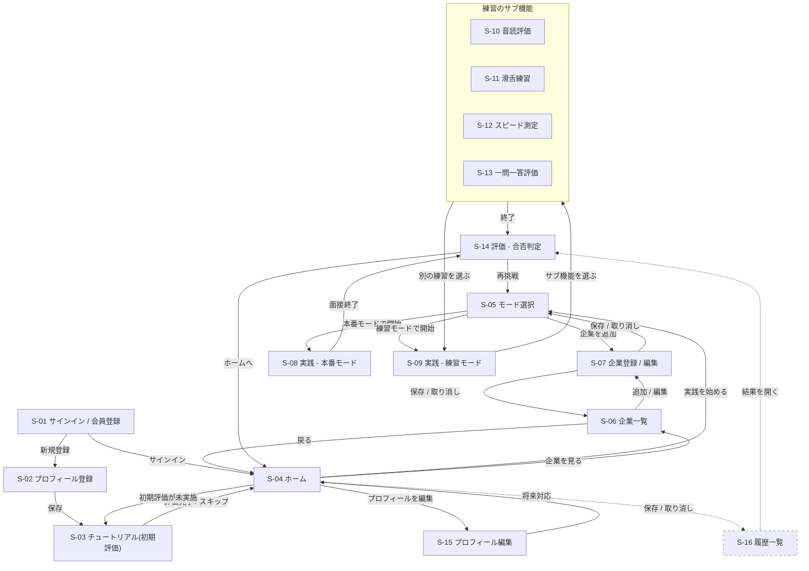

# 画面遷移図

- ステータス: レビュー待ち
- 対象: フロントエンド
- 作成日: 2026-08-13
- 対応 Issue: [#27 \[frontend\]画面一覧・画面遷移図を決定する](https://github.com/study-basic-hackathon/hanasu/issues/27)
- 関連: [画面一覧](screen_list.md)、[ユースケース・ユーザーフロー.md](../../ユースケース・ユーザーフロー.md)

## 1. 本書の位置づけ

**[画面一覧](screen_list.md) が定めた16画面について、どの操作でどの画面へ移るかを定める。** 各画面の役割・表示情報は画面一覧が持ち、本書は遷移だけを扱う。

未認証状態でのリダイレクト、エラー時の画面、ローディング中の表示といった全画面に共通する挙動は本書の対象外で、[#9](https://github.com/study-basic-hackathon/hanasu/issues/9) の共通仕様で定める。

## 2. 全体の画面遷移図

点線は**将来対応**の遷移（履歴一覧 S-16）を示す。

## 3. 遷移一覧

| # | 遷移元 | 遷移先 | 契機 | 備考 |
|---:|---|---|---|---|
| 1 | S-01 サインイン / 会員登録 | S-02 プロフィール登録 | 新規登録が完了した | 初回のみ通る |
| 2 | S-01 サインイン / 会員登録 | S-04 ホーム | サインインに成功した | 2回目以降の入口 |
| 3 | S-02 プロフィール登録 | S-03 チュートリアル | プロフィールを保存した | |
| 4 | S-03 チュートリアル | S-04 ホーム | 初期評価が完了した、またはスキップした | |
| 5 | S-04 ホーム | S-05 モード選択 | 「実践を始める」を選んだ | 主導線 |
| 6 | S-04 ホーム | S-03 チュートリアル | 未実施の初期評価を受けることを選んだ | 初期評価が未実施のときだけ導線を出す |
| 7 | S-04 ホーム | S-06 企業一覧 | 登録済み企業を見ることを選んだ | |
| 8 | S-04 ホーム | S-15 プロフィール編集 | プロフィールの編集を選んだ | |
| 9 | S-04 ホーム | S-16 履歴一覧 | 過去の結果を見ることを選んだ | **将来対応** |
| 10 | S-05 モード選択 | S-07 企業登録 / 編集 | 「企業を追加」を選んだ | 登録済み企業が0件のときは追加を促す |
| 11 | S-05 モード選択 | S-08 本番モード | 本番モードを選んで開始した | 企業未選択では開始できない |
| 12 | S-05 モード選択 | S-09 練習モード | 練習モードを選んで開始した | 同上 |
| 13 | S-06 企業一覧 | S-07 企業登録 / 編集 | 企業の追加または編集を選んだ | 削除は S-06 内で完結する |
| 14 | S-06 企業一覧 | S-04 ホーム | 戻ることを選んだ | |
| 15 | S-07 企業登録 / 編集 | 呼び出し元（S-05 または S-06） | 保存した、または取り消した | 呼び出し元へ戻る |
| 16 | S-08 本番モード | S-14 評価 | 一定の質問数に達した、または面接官が終了を判断した | |
| 17 | S-09 練習モード | S-10〜S-13 | サブ機能を選んだ | |
| 18 | S-10〜S-13 練習のサブ機能 | S-14 評価 | 練習を終えた | |
| 19 | S-10〜S-13 練習のサブ機能 | S-09 練習モード | 別の練習を続けることを選んだ | |
| 20 | S-14 評価 | S-05 モード選択 | 再挑戦を選んだ | UC-09 に対応 |
| 21 | S-14 評価 | S-04 ホーム | ホームに戻ることを選んだ | |
| 22 | S-15 プロフィール編集 | S-04 ホーム | 保存した、または取り消した | |
| 23 | S-16 履歴一覧 | S-14 評価 | 過去の結果を開いた | **将来対応。** 評価画面を再表示する |

## 4. 参考

- [画面一覧](screen_list.md) — 本書が扱う16画面の定義と画面 ID
- [ユースケース・ユーザーフロー.md](../../ユースケース・ユーザーフロー.md) 6章 — 本書の土台となるユーザーフロー
