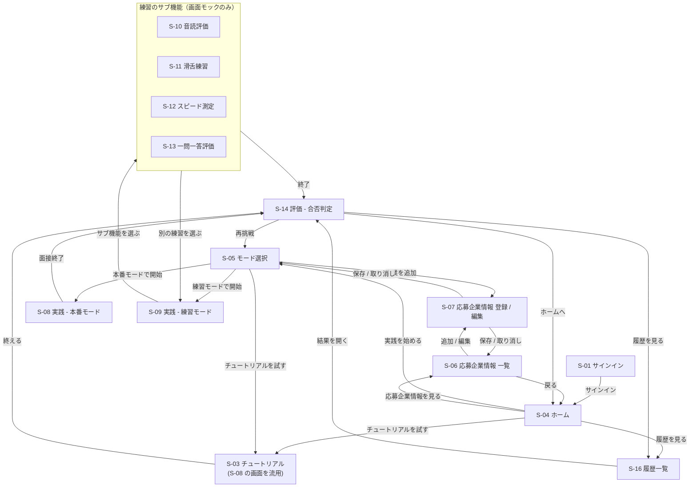

# 画面遷移図

## 1. 本書の位置づけ

**[画面一覧](screen_list.md) が定めた14画面について、どの操作でどの画面へ移るかを定める。** 各画面の役割・表示情報は画面一覧が持ち、本書は遷移だけを扱う。

未認証状態でのリダイレクト、エラー時の画面、ローディング中の表示といった全画面に共通する挙動は本書の対象外で、[#9](https://github.com/study-basic-hackathon/hanasu/issues/9) の共通仕様で定める。

**S-02 / S-15 は欠番のため本書には現れない**（[画面一覧](screen_list.md)）。

## 2. 全体の画面遷移図

## 3. 遷移一覧

| # | 遷移元 | 遷移先 | 契機 | 備考 |
|---:|---|---|---|---|
| 1 | S-01 サインイン | S-04 ホーム | サインインに成功した | **唯一の入口。** 会員登録の導線は持たない（[ADR-0011](../../ADR/0011-会員登録と利用アカウント.md)） |
| 2 | S-04 ホーム | S-05 モード選択 | 「実践を始める」を選んだ | 主導線 |
| 3 | S-04 ホーム | S-03 チュートリアル | チュートリアルを試すことを選んだ | **必須ではない。** 応募企業情報が未登録でも入れる |
| 4 | S-04 ホーム | S-06 応募企業情報 一覧 | 登録済みの応募企業情報を見ることを選んだ | |
| 5 | S-04 ホーム | S-16 履歴一覧 | 過去の結果を見ることを選んだ | |
| 6 | S-03 チュートリアル | S-14 評価 | 自己紹介1問に回答し終えた | |
| 7 | S-05 モード選択 | S-07 応募企業情報 登録 / 編集 | 「企業を追加」を選んだ | 登録済みが0件のときは追加を促す |
| 8 | S-05 モード選択 | S-08 本番モード | 本番モードを選んで開始した | 企業未選択では開始できない |
| 9 | S-05 モード選択 | S-09 練習モード | 練習モードを選んで開始した | **モックのため実際の練習は行わない** |
| 10 | S-05 モード選択 | S-03 チュートリアル | チュートリアルを試すことを選んだ | **応募企業情報が0件のときに出す。** 登録に進むか、先にチュートリアルで体験するかを選べる |
| 11 | S-06 応募企業情報 一覧 | S-07 応募企業情報 登録 / 編集 | 追加または編集を選んだ | 削除は S-06 内で完結する |
| 12 | S-06 応募企業情報 一覧 | S-04 ホーム | 戻ることを選んだ | |
| 13 | S-07 応募企業情報 登録 / 編集 | 呼び出し元（S-05 または S-06） | 保存した、または取り消した | 呼び出し元へ戻る |
| 14 | S-08 本番モード | S-14 評価 | 面接を終える操作をした、または**画面が持つターン数の上限に達した** | **サーバーは終了を判断しない**（[ADR-0008](../../ADR/0008-会話用APIの構成.md)） |
| 15 | S-09 練習モード | S-10〜S-13 | サブ機能を選んだ | **モックのみ** |
| 16 | S-10〜S-13 練習のサブ機能 | S-14 評価 | 練習を終えた | **モックのみ** |
| 17 | S-10〜S-13 練習のサブ機能 | S-09 練習モード | 別の練習を続けることを選んだ | **モックのみ** |
| 18 | S-14 評価 | S-05 モード選択 | 再挑戦を選んだ | UC-09 に対応 |
| 19 | S-14 評価 | S-16 履歴一覧 | 過去の結果を見ることを選んだ | UC-10 に対応。**直前の結果を過去の結果と見比べる導線** |
| 20 | S-14 評価 | S-04 ホーム | ホームに戻ることを選んだ | **チュートリアル直後もこの導線で戻る。** 応募企業情報の登録へは S-04 から入る |
| 21 | S-16 履歴一覧 | S-14 評価 | 過去の結果を開いた | 評価画面を再表示する |

## 4. 参考

- [画面一覧](screen_list.md) — 本書が扱う14画面の定義と画面 ID
- [ユースケース・ユーザーフロー.md](../../ユースケース・ユーザーフロー.md) 6章 — 本書の土台となるユーザーフロー
- [画面と API の対応](screen_api_map.md) — 各遷移の契機で呼ぶ API
- [ADR-0011 会員登録と利用アカウント](../../ADR/0011-会員登録と利用アカウント.md) — 会員登録の導線を持たない根拠
