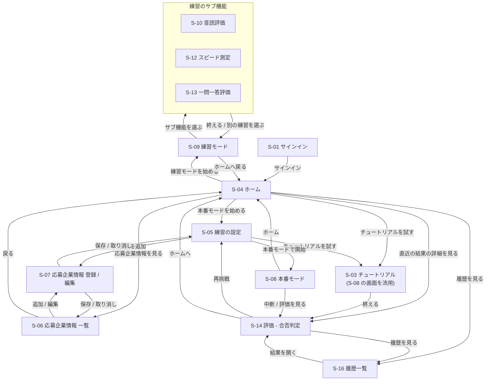

# 画面遷移図

## 1. 本書の位置づけ

**[画面一覧](screen_list.md) が定めた14画面について、どの操作でどの画面へ移るかを定める。** 各画面の役割・表示情報は画面一覧が持ち、本書は遷移だけを扱う。

未認証状態でのリダイレクト、エラー時の画面、ローディング中の表示といった全画面に共通する挙動は本書の対象外で、[共通仕様](screen_common.md) で定める。

**グローバルヘッダーからの遷移は 2章の図に含めない。** ヘッダーを持つ6画面から3画面へ線が張られ、主要な導線が読めなくなるためである。**[4. ヘッダーからの遷移](#4-ヘッダーからの遷移) に表として定める。**

**S-02 / S-15 は欠番のため本書には現れない**（[画面一覧](screen_list.md)）。

## 2. 全体の画面遷移図

## 3. 遷移一覧

| # | 遷移元 | 遷移先 | 契機 | 備考 |
|---:|---|---|---|---|
| 1 | S-01 サインイン | S-04 ホーム | サインインに成功した | **唯一の入口。** 会員登録の導線は持たない（[ADR-0011](../../ADR/0011-会員登録と利用アカウント.md)） |
| 2 | S-04 ホーム | S-05 練習の設定 | 「本番モードを始める」を選んだ | 本番モードの主導線。**練習モードは設定を持たないため #2.1 で S-09 へ直接進む** |
| 2.1 | S-04 ホーム | S-09 練習モード | 「練習モードを始める」を選んだ | 設定する項目がないため設定画面を挟まない |
| 3 | S-04 ホーム | S-03 チュートリアル | チュートリアルを試すことを選び、回答方式と読み上げモードの確認を続行した | **必須ではない。** 応募企業情報が未登録でも入れる。初期値は `音声入力` と `読み上げる`（[S-05 の詳細仕様](screens/S-05_練習の設定.md)） |
| 4 | S-04 ホーム | S-06 応募企業情報 一覧 | 登録済みの応募企業情報を見ることを選んだ | |
| 5 | S-04 ホーム | S-16 履歴一覧 | 過去の結果を見ることを選んだ | |
| 6 | S-04 ホーム | S-14 評価 | 直近の評価結果の「詳細を見る」を選んだ | **直近の1件を再表示する。** 評価結果が0件のときはこの導線を出さない |
| 7 | S-03 チュートリアル | S-14 評価 | 自己紹介1問に回答し終えた | |
| 8 | S-05 練習の設定 | S-07 応募企業情報 登録 / 編集 | 「企業を追加」、または一覧中の企業の「編集」を選んだ | 登録済みが0件のときは追加を促し、S-05 を戻り先へ含める |
| 9 | S-05 練習の設定 | S-08 本番モード | 設定を確認して開始した | 企業未選択では開始できない。**選んだ回答方式のページへ進む** |
| 11 | S-05 練習の設定 | S-03 チュートリアル | チュートリアルを試すことを選び、回答方式と読み上げモードの確認を続行した | **登録件数にかかわらず常に出す。** 確認の初期値はこの画面での選択（[S-05 の詳細仕様](screens/S-05_練習の設定.md)） |
| 12 | S-06 応募企業情報 一覧 | S-07 応募企業情報 登録 / 編集 | 追加または編集を選んだ | 削除は S-06 内で完結する |
| 13 | S-06 応募企業情報 一覧 | S-04 ホーム | 戻ることを選んだ | |
| 14 | S-07 応募企業情報 登録 / 編集 | 呼び出し元（S-05 または S-06） | 保存した、または取り消した | 呼び出し元は `?from=` で受け取る |
| 15 | S-08 本番モード | S-14 評価 | 回答済みで「中断」を確定した、またはターン上限到達後に「評価を見る」を選んだ | **サーバーは終了を判断しない**（[ADR-0008](../../ADR/0008-会話用APIの構成.md)） |
| 16 | S-08 本番モード | S-04 ホーム | 「ホーム」を選んだ。回答済みの場合は確認を続行した | **評価 API を呼ばず、会話を破棄する。** 回答0件では確認しない |
| 16.1 | S-08 本番モード（音声入力） | S-08 本番モード（文字入力） | マイクを使えないため「文字入力モードで始め直す」を確定した | **会話を破棄し、同じ設定のまま文字入力のページを開き直す**（[共通仕様](screen_common.md) 8章） |
| 17 | S-09 練習モード | S-04 ホーム | 「ホームへ戻る」を選んだ | S-09 はグローバルヘッダーを持たないため、この導線で戻る |
| 18 | S-09 練習モード | S-10・S-12・S-13 | サブ機能を選んだ | S-10 は音読の一時評価、S-12・S-13 は画面モック |
| 19 | S-10・S-12・S-13 練習のサブ機能 | S-09 練習モード | 「終える」または「別の練習を選ぶ」を選んだ | S-10 の一時結果を含めて破棄する。保存評価を行わないため S-14 へは移らない（[S-09〜S-13 の詳細仕様](screens/S-09-S-13_練習モード.md)） |
| 20 | S-14 評価 | S-05 練習の設定 | 再挑戦を選んだ | UC-09 に対応 |
| 21 | S-14 評価 | S-16 履歴一覧 | 過去の結果を見ることを選んだ | UC-10 に対応。**直前の結果を過去の結果と見比べる導線** |
| 22 | S-14 評価 | S-04 ホーム | ホームに戻ることを選んだ | **チュートリアル直後もこの導線で戻る。** 応募企業情報の登録へは S-04 から入る |
| 23 | S-16 履歴一覧 | S-14 評価 | 過去の結果を開いた | 評価画面を再表示する |

**評価が失敗したときの「評価をやり直す」は画面遷移ではない。** S-14 の中で状態が処理中に戻る（[S-14 の詳細仕様](screens/S-14_評価.md)）。

**S-16 が0件のときの開始導線は S-04 へ戻す。** S-04 でモードを選んでから、本番モードは S-05、練習モードは S-09 へ進む。

## 4. ヘッダーからの遷移

**グローバルヘッダーを持つ画面（S-04・S-05・S-06・S-07・S-14・S-16）からは、下表の遷移がいつでもできる。** ヘッダーの構成は [共通仕様](screen_common.md) が正本である。

| 操作 | 遷移先 | 備考 |
|---|---|---|
| ロゴ「hanasu」 | S-04 ホーム | |
| ナビ「ホーム」 | S-04 ホーム | |
| ナビ「応募先企業」 | S-06 応募企業情報 一覧 | |
| ナビ「履歴」 | S-16 履歴一覧 | |
| サインアウト | S-01 サインイン | トークンを破棄して戻る。**サインアウト API は呼ばない**（[API仕様.md](../../backend/API仕様.md) 1. 共通事項） |

**S-04 の開始エリアからモードを選び、本番モードは S-05、練習モードは S-09 へ進む。**

**S-01・S-08・S-09〜S-13 はグローバルヘッダーを持たない。** S-08 は常時「ホーム」（→ S-04）を持ち、ターン上限前は「中断」（→ S-14）も持つ。S-09 は「ホームへ戻る」（→ S-04）、S-10〜S-13 は「別の練習を選ぶ」（→ S-09）だけを持つ。

## 5. 参考

- [画面一覧](screen_list.md) — 本書が扱う14画面の定義と画面 ID
- [共通仕様](screen_common.md) — グローバルヘッダーの構成と、未認証時の扱い
- [画面詳細仕様](screens/) — 各遷移の前後で画面が何を表示するか
- [ユースケース・ユーザーフロー.md](../../ユースケース・ユーザーフロー.md) 6章 — 本書の土台となるユーザーフロー
- [画面と API の対応](screen_api_map.md) — 各遷移の契機で呼ぶ API
- [ADR-0011 会員登録と利用アカウント](../../ADR/0011-会員登録と利用アカウント.md) — 会員登録の導線を持たない根拠
