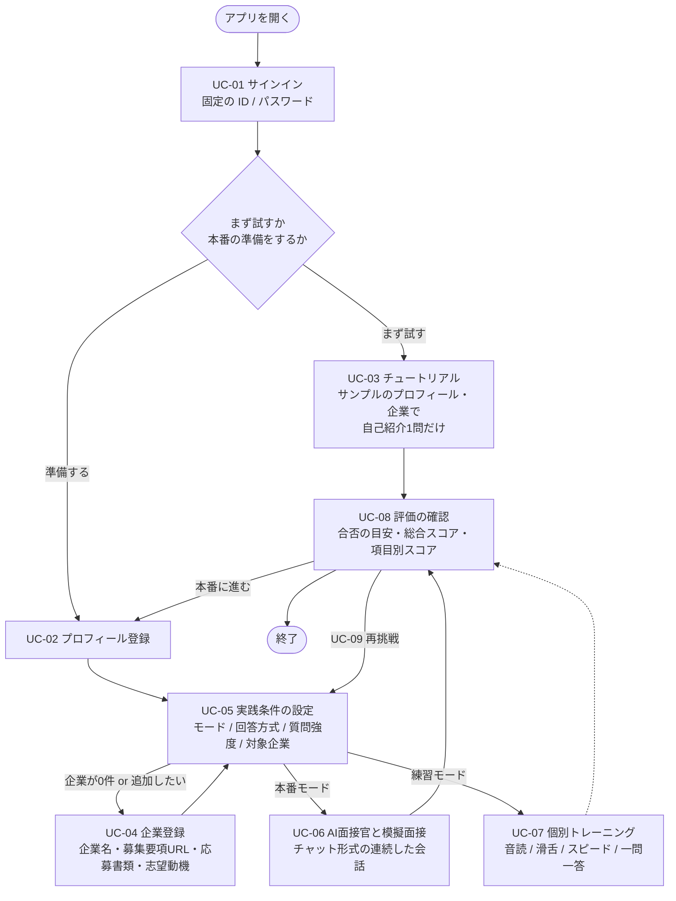

# ユースケース・ユーザーフロー

- ステータス: レビュー待ち
- 対象: サービス全体（common）
- 作成日: 2026-08-13
- 最終更新: 2026-08-16（チーム会議での決定を反映 — [2.2 ハッカソンで作る範囲](#22-ハッカソンで作る範囲)）
- 対応 Issue: [#14 \[common\]ユースケース・ユーザーフローの明文化](https://github.com/study-basic-hackathon/hanasu/issues/14)
- 関連: [必要api .md](<必要api .md>)、[技術スタック.md](技術スタック.md)

## 1. 本書の位置づけ

**「誰が・何のために本サービスを使うのか」と「その人がどういう順序で操作するのか」を定義する。** 以降の画面仕様・プロフィール項目・API 仕様は、すべて本書を土台とする。

本書は、チーム内で共有されている面接対策アプリの機能構成（[2. 前提とするサービス像](#2-前提とするサービス像)）を出発点として、そこから読み取れる利用者像と操作の流れを書き下したものである。**読み取れない事項は推測で埋めず、[8. 未確定事項](#8-未確定事項) に列挙する。**

なお、**会話機能の技術方式と評価方式は [#15](https://github.com/study-basic-hackathon/hanasu/issues/15) で先に確定している**（[ADR-0007](ADR/0007-会話音声の取得と保存方式.md)〜[ADR-0010](ADR/0010-音声認識とLLMの基盤選定.md)）。本書の記述はその決定と整合させてある。

### 本書で決めないこと

| 決めないこと | 扱う Issue |
|---|---|
| 画面一覧・画面遷移図・各画面の仕様 | [#27](https://github.com/study-basic-hackathon/hanasu/issues/27) / [#9](https://github.com/study-basic-hackathon/hanasu/issues/9) |
| 会話機能の技術方式（音声取得・送信方式など） | [#15](https://github.com/study-basic-hackathon/hanasu/issues/15) — **決定済み**（[ADR-0007](ADR/0007-会話音声の取得と保存方式.md)〜[ADR-0010](ADR/0010-音声認識とLLMの基盤選定.md)） |
| プロフィールの項目定義 | [#17](https://github.com/study-basic-hackathon/hanasu/issues/17) |
| API 仕様 | [#25](https://github.com/study-basic-hackathon/hanasu/issues/25) |
| UI 技術方針 | [#16](https://github.com/study-basic-hackathon/hanasu/issues/16) |

本書は**機能とその順序**だけを扱い、それを何画面でどう見せるかには踏み込まない。

## 2. 前提とするサービス像

### 2.1 機能構成

本書の記述はすべて、以下の機能構成を前提とする。**この前提が変われば本書のユースケースも見直す必要がある。**

| # | 前提 |
|---:|---|
| 1 | **PC のブラウザで利用する Web アプリとして提供する。** 専用のモバイルアプリは持たない |
| 2 | 利用にはサインインが必要。認証済みユーザーのみサービスを利用できる |
| 3 | **プロフィール（氏名・所属・志望業界など）を登録する。** 本番モードの質問生成に使う |
| 4 | **チュートリアルとして、本番モードと同じ画面で「1分で自己紹介してください」の1問だけを受けられる。** プロフィールと企業情報はサンプルが入った状態で始まるため、**何も登録していなくても試せる** |
| 5 | 志望企業ごとに、企業名・募集要項 URL・応募書類（エントリーシート等）・志望動機・備考を登録できる。複数登録・切り替えが可能 |
| 6 | 実践の前に、**モード（練習 / 本番）・回答方式（音声 / 文字入力）・質問強度（楽々 / 標準 / 圧迫）・対象企業**をまとめて選ぶ |
| 7 | **本番モードは、AI 面接官とチャット形式の連続した会話**として行う。登録した企業情報を踏まえた質問が、選んだ強度の言い回しで生成される |
| 8 | **練習モードは、音読評価・滑舌練習・スピード測定・一問一答評価などの個別トレーニング**を提供する |
| 9 | 実践後に、合否の目安・総合スコア・**項目別スコア（話の速さ / フィラーの数 / 構成・内容。任意で「間の長さ」）**を提示する。**判定は参考値であり、実際の選考結果を示すものではない旨を明示する** |
| 10 | 評価から実践条件の設定に戻り、何度でも再挑戦できる |

評価指標は **話の速さ / フィラーの数 / 構成・内容**の3つ（任意で「間の長さ」）と確定している。**「抑揚」「声の大きさ」は評価しない**（[ADR-0009](ADR/0009-評価方式.md)）。

### 2.2 ハッカソンで作る範囲

**2026-08-16 のチーム会議で、期間内に作る範囲を次のとおり決定した。** 本書のユースケース・フローはこの範囲を前提に記述する。

| 機能 | 扱い |
|---|---|
| **会員登録** | **作らない。** 固定の ID / パスワードでログインし、**ユーザーは1つだけ**とする（[ADR-0011](ADR/0011-会員登録と利用アカウント.md)） |
| サインイン | 作る（固定アカウント） |
| プロフィール登録 | 作る |
| **チュートリアル** | 作る。**本番モードの画面と API を流用し、サンプルのプロフィール・企業情報が入った状態で自己紹介1問だけを出題する。必須ではない** |
| 企業登録 | 作る |
| **本番モード** | **最優先で作り上げる** |
| **練習モード** | **画面のモックのみ作る。** 優先度は低く、本番モードを作り上げてから、流用できる部分を流用して着手する |
| 評価 | 作る |

**チュートリアルをこの形にした理由**: もともとは「練習モードを経て本番モードでどれだけ伸びたか」を測るための初期評価だった。**練習モードを当面作らないため、その前提が成り立たなくなった。** 一方で、本番モードにはプロフィールと企業情報の登録が要るため、**何も登録していない状態で最初に試せるもの**は残したい。本番モードと同じ画面・同じ API を使えば、追加実装をほとんど伴わずにこれを満たせる。

## 3. 想定ユーザー（誰が）

### 3.1 プライマリユーザー: 選考を控えた求職者

**新卒就活生と転職者の双方を対象とする。**

| 区分 | 誰が | 置かれた状況 |
|---|---|---|
| **新卒** | 就職活動中の大学生・大学院生 | 志望企業にエントリーシートを提出し、面接を控えている／選考が進行中 |
| **中途** | 転職活動中の社会人 | 応募書類を提出し、面接を控えている。**在職中で練習に使える時間・相手が限られる** |

両者に共通する前提:

| 項目 | 内容 |
|---|---|
| 困りごと | 面接の練習相手がいない／自分の話し方の何が悪いのか分からない／圧迫的な質問への耐性がない |
| 利用環境 | **PC のブラウザで利用する Web アプリ。** 音声モードではブラウザ経由でマイクを使う |
| 前提知識 | 一般的なアプリを操作できる程度。面接経験は初回〜数回 |
| 使うタイミング | 面接の直前期に、志望企業ごとに繰り返し練習する |

**新卒と中途で異なる点**（→ [8. 未確定事項](#8-未確定事項) #1）:

- プロフィールで扱う情報が違う（新卒: 大学・学部 ／ 中途: 職務経歴）
- 企業ごとに登録する応募書類が違う（新卒: エントリーシート ／ 中途: 職務経歴書）
- 想定される質問の傾向が違う（新卒: 学生時代の経験・志望動機 ／ 中途: 実務経験・転職理由）

**ハッカソンの範囲では固定アカウント1つで動かす**ため、複数ユーザーが同時に自分のプロフィール・企業情報を持つ状態は作らない。上記の利用者像は、サービスとして誰に向けたものかを示すものである。

### 3.2 対象としないユーザー

| 対象 | 扱い |
|---|---|
| 面接官・採用担当者 | **サービス上に登場しない。** AI 面接官がその役を担う |
| 大学のキャリアセンター職員・転職エージェントなどの第三者 | **管理・閲覧の機能を持たない。** ユーザー本人だけが自分の結果を見る |

### 3.3 アクター

| アクター | 種別 | 役割 |
|---|---|---|
| **求職者（ユーザー）** | 人間 | 唯一の人間アクター。登録・練習・結果確認のすべてを行う |
| **AI 面接官** | システム | 登録された企業情報と質問強度に応じて質問を生成し、回答に追及する |
| **評価エンジン** | システム | 発話を文字起こしし、**話の速さとフィラーの数を機械的に算出**したうえで、**構成・内容を評価**してスコア化する |

## 4. 利用目的（何のために）

### 4.1 ユーザーが達成したいこと

1. **志望企業の面接を想定した本番形式の練習を、相手なしで何度でも行う** — AI 面接官とのチャット形式の連続した会話として提供する
2. **自分の話し方の弱点を数値で知る** — 話の速さ（文字数 ÷ 発話時間）とフィラーの数
3. **話す内容と提出済み書類の一貫性を確認する** — 登録した応募書類・志望動機を踏まえた質問が生成される
4. **登録なしでまず試す** — チュートリアルとして、サンプルのプロフィール・企業情報が入った状態で自己紹介1問だけを受けられる
5. **繰り返して結果の変化を見る** — 同じ企業に対して何度も練習し、評価の履歴で変化を確認する
6. **圧迫的な質問に慣れる** — 質問強度を「楽々 / 標準 / 圧迫」から選べる

### 4.2 サービスが提供する価値

**「面接の練習相手がいない」「自分の話し方の弱点が分からない」を、AI 面接官との模擬面接と、話し方の定量評価の2点で解消する。** 人を相手にした練習と違い、時間・回数・相手の都合の制約を受けずに、同じ企業に対して何度でも試行できる。

### 4.3 非目標（このサービスがやらないこと）

| 非目標 | 理由 |
|---|---|
| **実際の選考結果を予測・保証すること** | 「アプリでは合格ラインだったが実際は不合格だった」というケースが避けられない。判定は参考値である旨を必ず明示する |
| 求人紹介・企業とのマッチング | 企業情報はユーザー自身が登録するものであり、サービス側は求人データを持たない |
| 採用側・支援者側の利用（結果の共有・管理） | 第三者が結果を閲覧・管理する機能は持たない |
| 面接以外の就職・転職支援（書類添削そのもの、適性検査対策） | 応募書類は質問生成の入力として使うだけで、添削は行わない |

## 5. ユースケース一覧

「実装範囲」は [2.2 ハッカソンで作る範囲](#22-ハッカソンで作る範囲) に対応する。

| ID | ユースケース | 目的 | 事前条件 | 事後条件 | 実装範囲 |
|---|---|---|---|---|---|
| **UC-01** | サインインする | サービスを利用可能な状態にする | なし | ユーザーが認証済みになる | 作る（**固定の ID / パスワード**） |
| **UC-02** | プロフィールを登録する | 面接内容をパーソナライズする材料を渡す | 認証済み | プロフィールが保存される | 作る |
| **UC-03** | チュートリアルを試す | **何も登録していない状態で、面接練習がどういうものかを体験する** | 認証済み（**プロフィール・企業の登録は不要**） | 自己紹介1問への評価が得られる | 作る（**本番モードの画面・API を流用**） |
| **UC-04** | 志望企業を登録する | 企業ごとの質問を生成させる | 認証済み | 企業が一覧に追加され、選択可能になる | 作る |
| **UC-05** | 実践の条件を設定する | モード・回答方式・質問強度・対象企業を決める | 認証済み／企業が1件以上登録済み | 選択内容が実践に引き継がれる | 作る |
| **UC-06** | 本番モードで模擬面接を受ける | 本番に近い形式で通しの面接を体験する | UC-05 完了 | 質問と回答のログが蓄積され、評価対象になる | **最優先で作る** |
| **UC-07** | 練習モードで個別トレーニングを行う | 弱点（音読・滑舌・スピード・一問一答）を個別に補強する | UC-05 完了 | サブ機能ごとの個別スコアが得られる | **画面モックのみ** |
| **UC-08** | 評価結果を確認する | 合否の目安・総合スコア・項目別スコアを受け取る | UC-03 または UC-06 完了 | 判定とスコアが保存され、履歴として参照できる | 作る |
| **UC-09** | 条件を変えて再挑戦する | 弱点を踏まえて練習を繰り返す | UC-08 完了 | UC-05 に戻る | 作る |

**会員登録のユースケースは持たない。** ハッカソンの範囲では固定アカウント1つを使うため（[2.2](#22-ハッカソンで作る範囲)）。

## 6. 主要ユーザーフロー

### 6.1 全体フロー

**破線は画面モックのみを作る範囲**（UC-07 練習モード）。

### 6.2 メインフロー: 初回利用（サインイン → 模擬面接 → 評価の確認）

**シナリオ**: 志望企業の面接を1週間後に控えた求職者。練習相手がおらず、自分の話し方に自信がない。

| # | ユーザーの操作 | システムの応答 |
|---:|---|---|
| 1 | 配布された固定の ID / パスワードでサインインする | 認証してサービスを利用可能にする |
| 2 | （任意）**チュートリアル**を試す。サンプルのプロフィール・企業情報が入った状態で「1分で自己紹介してください」に答える | 本番モードと同じ画面・同じ仕組みで**1問だけ**出題し、回答を評価する |
| 3 | プロフィールを入力する | 必須項目が未入力なら次へ進ませない |
| 4 | 志望企業を登録する（企業名・募集要項 URL・応募書類・志望動機・備考） | 企業名は必須。保存すると企業一覧に追加される |
| 5 | 「本番」「音声」「標準」と、登録した企業を選んで開始する | 企業が未選択なら開始させない。選択内容を実践へ引き継ぐ |
| 6 | AI 面接官の質問（例:「自己紹介をお願いします」）に、マイクで回答する | **登録された応募書類・志望動機・募集要項を踏まえた質問**を、選んだ強度の言い回しで生成する。回答に対して追及する |
| 7 | **自分で終了操作をするまで**会話を続ける | 質問と回答のログを蓄積する。**面接官の側から打ち切ることはしない**（ターン数の上限に達した場合のみ終了を促す）。終了時に評価へ進む |
| 8 | 評価結果を見る | 合否の目安・総合スコア・項目別スコア（話の速さ / フィラーの数 / 構成・内容）と、**参考値である旨の免責**を表示する。結果は履歴として保存する |
| 9 | 条件を変えて再挑戦する | 実践条件の設定に戻る |

**この1本が Issue #14 の完了条件「登録 → 会話 → 評価の確認」に対応する主要フローである。**

### 6.3 サブフロー: チュートリアル

**何も登録していない状態で、面接練習がどういうものかを体験する。必須ではなく、飛ばして本番の準備に進んでもよい。**

1. サインイン後、チュートリアルを選ぶ
2. **プロフィールと企業情報はサンプルが入った状態**で始まる（ユーザーは何も入力しない）
3. 「1分で自己紹介してください」の**1問だけ**出題される
4. 回答すると評価が表示される（UC-08 と同じ）
5. 続けて本番をやるなら、プロフィール登録へ進む

**本番モードと同じ画面・同じ API を使う。** 質問が1問に固定され、プロフィール・企業情報がサンプルである点だけが異なる。

### 6.4 2回目以降のフロー

プロフィール・企業が登録済みのため、準備の手順を飛ばす。

1. サインインする
2. 実践条件を設定する — 前回と違う企業・強度・回答方式を選べる
3. 本番モードを実施する
4. 評価を確認し、**前回までの結果と比較する**

### 6.5 サブフロー: 企業の追加登録

実践条件の設定から企業登録へ抜け、保存後に元へ戻る往復フロー。

1. 実践条件の設定で「企業を追加」を選ぶ
2. 企業名（必須）・募集要項 URL・応募書類・志望動機・備考を入力して保存する
3. 実践条件の設定に戻り、追加した企業が選択リストに現れる

**登録済み企業が0件の場合は、企業追加を促す。** 複数企業を登録し、切り替えて練習できる。

### 6.6 サブフロー: 練習モード（画面モックのみ）

本番形式ではなく、弱点ごとの個別トレーニングを行う。**ハッカソンの範囲では画面のモックだけを作り、動作はさせない。**

1. 実践条件の設定で「練習」を選んで開始する
2. サブメニューから1つ選ぶ — 音読評価 / 滑舌練習 / スピード測定 / 一問一答評価（志望動機など）
3. 各練習を終えると個別スコアとフィードバックが出る
4. 評価へ進むか、別の練習を続ける

**本番モードを作り上げたあと、流用できる部分を流用して着手する。**

### 6.7 例外・分岐

| 状況 | ユーザーから見た挙動 |
|---|---|
| サインインに失敗した | エラーメッセージが表示され、再入力できる |
| プロフィール・企業を登録せずに本番モードを始めようとした | 開始できない。**先にチュートリアルで体験するか、登録に進む**よう促される |
| 登録済み企業が0件のまま実践を始めようとした | 開始できない（非活性または警告）。企業追加を促される |
| プロフィールに未入力項目がある | 次へ進めない |
| 文字入力モードを選んだ | マイクを使わず、テキストで回答する |
| 評価が期待より低かった | 参考値である旨の免責を読み、条件を変えて再挑戦できる |
| 会話の途中でページを再読み込みした・タブを閉じた | **その会話は失われる**（音声・会話履歴をサーバーに保存しないため。[ADR-0007](ADR/0007-会話音声の取得と保存方式.md)） |

## 7. 用語

| 用語 | 定義 |
|---|---|
| **本番モード** | AI 面接官とチャット形式で連続した会話を行う模擬面接。**最優先で作る** |
| **練習モード** | 音読・滑舌・スピード・一問一答など、弱点を個別に鍛えるトレーニング。**ハッカソンの範囲では画面モックのみ** |
| **チュートリアル** | 本番モードと同じ画面・API を使い、**サンプルのプロフィール・企業情報が入った状態で自己紹介1問だけ**を受ける体験。何も登録していなくても試せる。必須ではない |
| **質問強度** | 面接官の質問の言い回しと追及度。**楽々 / 標準 / 圧迫**の3段階 |
| **回答方式** | 回答の入力手段。**音声モード**（マイク）または**文字入力モード**（テキスト） |
| **応募書類** | 企業ごとに登録する提出物。新卒はエントリーシート、中途は職務経歴書を想定する |
| **フィラー** | 「えー」「あのー」など、意味を持たないつなぎの発話。**数を数えて評価指標にする** |
| **項目別スコア** | 観点ごとの評価値。**話の速さ / フィラーの数 / 構成・内容**の3つ（任意で「間の長さ」）（[ADR-0009](ADR/0009-評価方式.md)） |
| **合否判定** | 合格ラインに到達したかの**参考表示**。実際の選考結果を示すものではない |

## 8. 未確定事項

**ユースケースに影響するものに限って列挙する。** 本書では決めない。

| # | 未確定事項 | なぜ決める必要があるか | 決めるべき場所 |
|---:|---|---|---|
| 1 | **新卒と中途で、プロフィール項目・応募書類・質問傾向を分けるか** | 双方を対象に含めたことで生じた論点。「大学・学部」を必須にすると中途が登録できない。分けるなら登録時に区分を選ばせる必要がある | [#17](https://github.com/study-basic-hackathon/hanasu/issues/17) プロフィール項目定義 |
| 2 | **チュートリアルで使うサンプルのプロフィール・企業情報の中身** | 「何も登録していなくても試せる」ことが成立する条件。**誰がどんな内容を用意するかが未定** | [#17](https://github.com/study-basic-hackathon/hanasu/issues/17) / [#27](https://github.com/study-basic-hackathon/hanasu/issues/27) |
| 3 | **チュートリアルの評価結果を履歴に残すか** | 残すと、サンプル企業に対する結果が本番の履歴に混ざる | [#27](https://github.com/study-basic-hackathon/hanasu/issues/27) |
| 4 | **過去の結果を見る画面の導線** | 評価履歴を企業ごとに取得する API は [ADR-0008](ADR/0008-会話用APIの構成.md) で確定済み。**画面のどこから開くかが未定**で、UC-08 の「繰り返して変化を見る」に直結する | [#27](https://github.com/study-basic-hackathon/hanasu/issues/27) |
| 5 | **プロフィールを後から編集できるか** | 志望業界の変更や、選考の進行に応じた更新が想定される | [#27](https://github.com/study-basic-hackathon/hanasu/issues/27) |
| 6 | **募集要項 URL からの情報自動取得** | UC-04 の入力負荷を大きく左右する。任意機能の位置づけ | 別 Issue |
| 7 | **「圧迫」モードの文言と説明** | **利用者が選考中の求職者である以上、受け止め方への配慮が要る。** 機能自体の要否ではなく表現の問題 | [#27](https://github.com/study-basic-hackathon/hanasu/issues/27) / [#9](https://github.com/study-basic-hackathon/hanasu/issues/9) |
| 8 | **練習モードのサブ機能をどう評価するか** | 確定した評価指標（話の速さ / フィラーの数 / 構成・内容）に**「滑舌」は含まれない**（[ADR-0009](ADR/0009-評価方式.md)）。モックの先に進める際に必要になる | 練習モードの実装時 |

## 9. 参考

- [必要api .md](<必要api .md>) — 会話・評価に必要な API 一覧
- [ADR-0007 会話音声の取得と保存方式](ADR/0007-会話音声の取得と保存方式.md) — ブラウザで録音し、音声は永続化しない
- [ADR-0008 会話用APIの構成](ADR/0008-会話用APIの構成.md) — 面接は自由会話。**終了判定はユーザーの終了操作のみ**
- [ADR-0009 評価方式](ADR/0009-評価方式.md) — **評価指標は3つ。抑揚・声の大きさは採らない**
- [ADR-0010 音声認識とLLMの基盤選定](ADR/0010-音声認識とLLMの基盤選定.md) — STT は AmiVoice、LLM は Bedrock
- [ADR-0011 会員登録と利用アカウント](ADR/0011-会員登録と利用アカウント.md) — **会員登録を作らず、固定の ID / パスワード1組で利用する**
- [技術スタック.md](技術スタック.md)
- [検討記録: AI 向けタスク運用方針](00_検討/20260808_AI向けタスク運用方針.md) — 本 Issue の起票根拠
- [task-memo 0804-Frontend仕様書作成](task-memo/0804-Frontend仕様書作成.md)（凍結済み） — 「全画面仕様の土台になるため最優先」と指摘された項目
