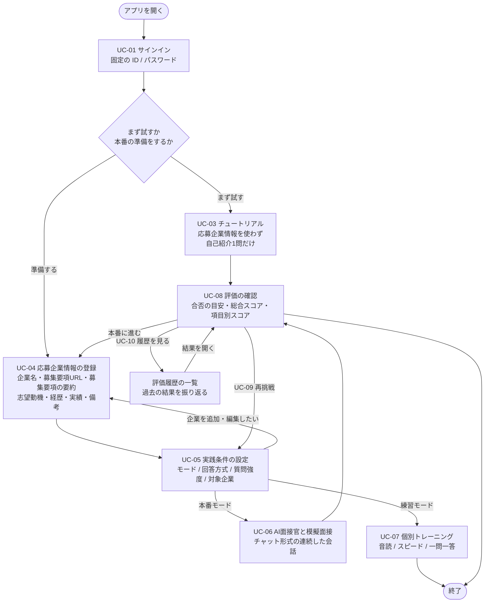

# ユースケース・ユーザーフロー

## 1. 本書の位置づけ

**「誰が・何のために本サービスを使うのか」と「その人がどういう順序で操作するのか」を定義する。** 以降の画面仕様・登録項目の定義・API 仕様は、すべて本書を土台とする。

本書は、チーム内で共有されている面接対策アプリの機能構成（[2. 前提とするサービス像](#2-前提とするサービス像)）を出発点として、そこから読み取れる利用者像と操作の流れを書き下したものである。**読み取れない事項は推測で埋めず、[8. 未確定事項](#8-未確定事項) に列挙する。**

なお、**会話機能の技術方式と評価方式は [ADR-0007](ADR/0007-会話音声の取得と保存方式.md)〜[ADR-0010](ADR/0010-音声認識とLLMの基盤選定.md) で確定している。**

### 本書で決めないこと

| 決めないこと | 扱う場所 |
|---|---|
| 画面一覧・画面遷移図 | [画面一覧](frontend/01_design/screen_list.md) / [画面遷移図](frontend/01_design/screen_flow.md) |
| 各画面の詳細仕様 | [画面詳細仕様](frontend/01_design/screens/) / [共通仕様](frontend/01_design/screen_common.md) |
| 会話機能の技術方式（音声取得・送信方式など） | [ADR-0007](ADR/0007-会話音声の取得と保存方式.md)〜[ADR-0010](ADR/0010-音声認識とLLMの基盤選定.md) |
| 応募企業情報の項目定義（応募者自身の情報を含む） | [API仕様.md](backend/API仕様.md) 4章 |
| API 仕様 | [API仕様.md](backend/API仕様.md) |
| UI 技術方針 | [ADR-0014](ADR/0014-UI技術方針.md) |

本書は**機能とその順序**だけを扱い、それを何画面でどう見せるかには踏み込まない。

## 2. 前提とするサービス像

### 2.1 機能構成

本書の記述はすべて、以下の機能構成を前提とする。**この前提が変われば本書のユースケースも見直す必要がある。**

| # | 前提 |
|---:|---|
| 1 | **PC のブラウザで利用する Web アプリとして提供する。** 専用のモバイルアプリは持たない |
| 2 | 利用にはサインインが必要。認証済みユーザーのみサービスを利用できる |
| 3 | **プロフィールという独立した登録は持たない。** 志望動機・経歴といった応募者自身の情報は、**応募企業情報（前提5）の一部として登録する** |
| 4 | **チュートリアルとして、本番モードと同じ画面で「1分で自己紹介してください」の1問だけを受けられる。** **応募企業情報を使わずに実行するため、何も登録していなくても試せる**（サンプルの応募企業情報は用意しない） |
| 5 | **応募企業情報を志望企業ごとに登録する。** 企業名・募集要項 URL・募集要項の要約・志望動機・経歴・実績・備考の6項目を**1つの画面でまとめて**登録し、複数登録・切り替えができる。**登録後も編集できる** |
| 6 | 実践の前に、**モード（練習 / 本番）・回答方式（音声入力 / 文字入力）・質問強度（楽々 / 標準 / 厳しめ）・対象企業**をまとめて選ぶ |
| 7 | **本番モードは、AI 面接官とチャット形式の連続した会話**として行う。登録した企業情報を踏まえた質問が、選んだ強度の言い回しで生成される |
| 8 | **練習モードは、音読評価・スピード測定・一問一答評価の個別トレーニング**を提供する |
| 9 | 実践後に、合否の目安・総合スコア・**項目別スコア（話の速さ / フィラーの数 / 構成・内容。任意で「間の長さ」）**を提示する。**判定は参考値であり、実際の選考結果を示すものではない旨を明示する** |
| 10 | 評価から実践条件の設定に戻り、何度でも再挑戦できる |
| 11 | **過去の評価結果を一覧で参照できる。** 一覧から個別の結果を開ける |

評価指標は **話の速さ / フィラーの数 / 構成・内容**の3つ（任意で「間の長さ」）と確定している。**「抑揚」「声の大きさ」は評価しない**（[ADR-0009](ADR/0009-評価方式.md)）。

### 2.2 ハッカソンで作る範囲

**ハッカソンの期間内に作る範囲を次のとおり定める。** 本書のユースケース・フローはこの範囲を前提に記述する。

| 機能 | 扱い |
|---|---|
| **会員登録** | **作らない。** 固定の ID / パスワードでログインし、**ユーザーは1つだけ**とする（[ADR-0011](ADR/0011-会員登録と利用アカウント.md)） |
| サインイン | 作る（固定アカウント） |
| **プロフィール登録（単独の画面）** | **作らない。** 応募者自身の情報は**応募企業情報の登録に集約する** |
| **チュートリアル** | 作る。**本番モードの画面を流用し、自己紹介1問だけを出題する。応募企業情報は使わない**（サンプルも用意しない）。**必須ではない** |
| **応募企業情報の登録** | 作る。**企業ごとの情報と応募者自身の情報を1つの画面で登録する** |
| **本番モード** | **作る** |
| **練習モード** | S-09 のメニューと S-10 音読評価を作る。S-10 の結果は一時表示だけとし、保存しない。S-12 スピード測定と S-13 一問一答評価は画面モック |
| 評価 | 作る |
| **評価履歴の一覧** | **作る** |

## 3. 想定ユーザー（誰が）

### 3.1 プライマリユーザー: 選考を控えた求職者

**新卒就活生と転職者の双方を対象とする。**

| 区分 | 誰が | 置かれた状況 |
|---|---|---|
| **新卒** | 就職活動中の大学生・大学院生 | 志望企業にエントリーシートを提出し、面接を控えている／選考が進行中 |
| **中途** | 転職活動中の社会人 | 応募書類を提出し、面接を控えている。**在職中で練習に使える時間・相手が限られる** |

両者に共通する前提:

| 項目 | 内容 |
|---|---|
| 困りごと | 面接の練習相手がいない／自分の話し方の何が悪いのか分からない／厳しい質問への耐性がない |
| 利用環境 | **PC のブラウザで利用する Web アプリ。** 音声モードではブラウザ経由でマイクを使う |
| 前提知識 | 一般的なアプリを操作できる程度。面接経験は初回〜数回 |
| 使うタイミング | 面接の直前期に、志望企業ごとに繰り返し練習する |

**応募企業情報の6項目は新卒・中途で共通とする。** 大学・学部、職種、応募書類の専用項目は持たない。新卒と中途で想定される質問の傾向は異なるが、登録項目の区分は増やさない。

**ハッカソンの範囲では固定アカウント1つで動かす**ため、複数ユーザーが同時に自分の応募企業情報を持つ状態は作らない。上記の利用者像は、サービスとして誰に向けたものかを示すものである。

### 3.2 対象としないユーザー

| 対象 | 扱い |
|---|---|
| 面接官・採用担当者 | **サービス上に登場しない。** AI 面接官がその役を担う |
| 大学のキャリアセンター職員・転職エージェントなどの第三者 | **管理・閲覧の機能を持たない。** ユーザー本人だけが自分の結果を見る |

### 3.3 アクター

| アクター | 種別 | 役割 |
|---|---|---|
| **求職者（ユーザー）** | 人間 | 唯一の人間アクター。登録・練習・結果確認のすべてを行う |
| **AI 面接官** | システム | 登録された企業情報と質問強度に応じて質問を生成し、回答に追及する |
| **評価エンジン** | システム | 発話を文字起こしし、**話の速さとフィラーの数を機械的に算出**したうえで、**構成・内容を評価**してスコア化する |

## 4. 利用目的（何のために）

### 4.1 ユーザーが達成したいこと

1. **志望企業の面接を想定した本番形式の練習を、相手なしで何度でも行う** — AI 面接官とのチャット形式の連続した会話として提供する
2. **自分の話し方の弱点を数値で知る** — 話の速さ（文字数 ÷ 発話時間）とフィラーの数
3. **志望企業に合わせた質問に答える** — 登録した募集要項の URL・要約、志望動機、経歴・実績を踏まえた質問が生成される
4. **登録なしでまず試す** — チュートリアルとして、応募企業情報を登録しないまま自己紹介1問だけを受けられる
5. **繰り返して結果の変化を見る** — 同じ企業に対して何度も練習し、**評価履歴の一覧**で変化を確認する
6. **厳しい質問に慣れる** — 質問強度を「楽々 / 標準 / 厳しめ」から選べる

### 4.2 サービスが提供する価値

**「面接の練習相手がいない」「自分の話し方の弱点が分からない」を、AI 面接官との模擬面接と、話し方の定量評価の2点で解消する。** 人を相手にした練習と違い、時間・回数・相手の都合の制約を受けずに、同じ企業に対して何度でも試行できる。

### 4.3 非目標（このサービスがやらないこと）

| 非目標 | 理由 |
|---|---|
| **実際の選考結果を予測・保証すること** | 「アプリでは合格ラインだったが実際は不合格だった」というケースが避けられない。判定は参考値である旨を必ず明示する |
| 求人紹介・企業とのマッチング | 企業情報はユーザー自身が登録するものであり、サービス側は求人データを持たない |
| 採用側・支援者側の利用（結果の共有・管理） | 第三者が結果を閲覧・管理する機能は持たない |
| 面接以外の就職・転職支援（書類添削そのもの、適性検査対策） | 応募書類のアップロード・保存・添削は行わない |

## 5. ユースケース一覧

「実装範囲」は [2.2 ハッカソンで作る範囲](#22-ハッカソンで作る範囲) に対応する。

| ID | ユースケース | 目的 | 事前条件 | 事後条件 | 実装範囲 |
|---|---|---|---|---|---|
| **UC-01** | サインインする | サービスを利用可能な状態にする | なし | ユーザーが認証済みになる | 作る（**固定の ID / パスワード**） |
| **UC-02** | ~~プロフィールを登録・編集する~~ **（廃止）** | — | — | — | **持たない。** UC-04 に統合した |
| **UC-03** | チュートリアルを試す | **何も登録していない状態で、面接練習がどういうものかを体験する** | 認証済み（**応募企業情報の登録は不要**） | 自己紹介1問への評価が得られる | 作る（**本番モードの画面・API を流用**） |
| **UC-04** | 応募企業情報を登録・編集する | 企業ごとの質問を生成させる材料（**企業の情報と応募者自身の情報**）を渡す | 認証済み | 応募企業が一覧に追加され、選択可能になる | 作る（**登録後も編集できる**） |
| **UC-05** | 実践の条件を設定する | モード・回答方式・質問強度・対象企業を決める | 認証済み／応募企業情報が1件以上登録済み | 選択内容が実践に引き継がれる | 作る |
| **UC-06** | 本番モードで模擬面接を受ける | 本番に近い形式で通しの面接を体験する | UC-05 完了 | 質問と回答のログが蓄積され、評価対象になる | 作る |
| **UC-07** | 練習モードで個別トレーニングを行う | 弱点（音読・スピード・一問一答）を個別に補強する | UC-05 完了 | 音読の話速・フィラーが画面内に一時表示され、保存せずに再練習できる | S-09・S-10 を作る。S-12・S-13 は画面モック |
| **UC-08** | 評価結果を確認する | 合否の目安・総合スコア・項目別スコアを受け取る | UC-03 または UC-06 完了 | 判定とスコアが保存され、履歴として参照できる | 作る |
| **UC-09** | 条件を変えて再挑戦する | 弱点を踏まえて練習を繰り返す | UC-08 完了 | UC-05 に戻る | 作る |
| **UC-10** | 評価履歴を一覧で確認する | 過去の結果を振り返り、変化を見る | UC-08 を1回以上完了 | 一覧から個別の評価結果を開ける | 作る |

- **会員登録のユースケースは持たない。** ハッカソンの範囲では固定アカウント1つを使うため（[2.2](#22-ハッカソンで作る範囲)）
- **UC-02（プロフィール登録）は廃止した。** 応募者自身の情報は UC-04 の応募企業情報に含める。**番号は他の資料から参照されているため繰り上げず、欠番として残す**

## 6. 主要ユーザーフロー

### 6.1 全体フロー

**UC-07 の音読評価は結果をその画面だけに一時表示し、UC-08 の保存評価へは進まない。** プロフィール登録は独立したステップとして持たない（応募企業情報の登録に含める）。

### 6.2 メインフロー: 初回利用（サインイン → 模擬面接 → 評価の確認）

**シナリオ**: 志望企業の面接を1週間後に控えた求職者。練習相手がおらず、自分の話し方に自信がない。

| # | ユーザーの操作 | システムの応答 |
|---:|---|---|
| 1 | 配布された固定の ID / パスワードでサインインする | 認証してサービスを利用可能にする |
| 2 | （任意）**チュートリアル**を試す。応募企業情報を登録しないまま「1分で自己紹介してください」に答える | 本番モードと同じ画面・同じ仕組みで**1問だけ**出題し、回答を評価する |
| 3 | **応募企業情報を登録する**（企業名・募集要項 URL・募集要項の要約・志望動機・経歴・実績・備考） | 企業名と志望動機は必須。保存すると応募企業の一覧に追加される。**プロフィールを別に入力する手順はない** |
| 4 | 「本番」「音声入力」「標準」と、登録した企業を選んで開始する | 企業が未選択なら開始させない。選択内容を実践へ引き継ぐ |
| 5 | AI 面接官の質問（例:「自己紹介をお願いします」）に、マイクで回答する | **登録された募集要項の URL・要約、志望動機、経歴・実績、備考を踏まえた質問**を、選んだ強度の言い回しで生成する。回答に対して追及する |
| 6 | **自分で終了操作をするまで**会話を続ける | 質問と回答のログを蓄積する。**面接官の側から打ち切ることはしない**（ターン数の上限に達した場合のみ終了を促す）。終了時に評価へ進む |
| 7 | 評価結果を見る | 合否の目安・総合スコア・項目別スコア（話の速さ / フィラーの数 / 構成・内容）と、**参考値である旨の免責**を表示する。結果は履歴として保存する |
| 8 | 条件を変えて再挑戦する／**評価履歴の一覧で過去の結果と見比べる** | 実践条件の設定に戻る／履歴の一覧を表示する |

**「登録 → 会話 → 評価の確認」が本サービスの主要フローである。**

### 6.3 サブフロー: チュートリアル

**何も登録していない状態で、面接練習がどういうものかを体験する。必須ではなく、飛ばして本番の準備に進んでもよい。**

1. サインイン後、チュートリアルを選ぶ
2. **応募企業情報を使わずに始まる**（ユーザーは何も入力しない。サンプルも用意しない）
3. 「1分で自己紹介してください」の**1問だけ**出題される
4. 回答すると評価が表示される（UC-08 と同じ）
5. 続けて本番をやるなら、応募企業情報の登録へ進む

**本番モードと同じ画面を使う。** 質問が1問に固定され、**応募企業情報を使わない**点が異なる。次の質問を生成しないため会話APIを経由せず、**文字起こしAPIと評価API（企業IDなし）だけを使う**（[API仕様.md](backend/API仕様.md)）。

### 6.4 2回目以降のフロー

応募企業情報が登録済みのため、準備の手順を飛ばす。

1. サインインする
2. 実践条件を設定する — 前回と違う企業・強度・回答方式を選べる
3. 本番モードを実施する
4. 評価を確認し、**評価履歴の一覧で前回までの結果と比較する**

### 6.5 サブフロー: 応募企業情報の追加・編集

実践条件の設定から応募企業情報の登録へ抜け、保存後に元へ戻る往復フロー。

1. 実践条件の設定で「企業を追加」または既存の企業の編集を選ぶ
2. 企業名（必須）・募集要項 URL・募集要項の要約・志望動機（必須）・経歴・実績・備考を入力して保存する
3. 実践条件の設定に戻り、追加・更新した企業が選択リストに反映される

**登録が0件の場合は、追加を促す。** 複数の応募企業を登録し、切り替えて練習できる。**プロフィールを別に登録する画面は持たず、この画面にまとめる。**

### 6.6 サブフロー: 練習モード

本番形式ではなく、弱点ごとの個別トレーニングを行う。音読評価では課題文を読み上げた音声から話速とフィラーを測り、結果を保存せずに繰り返し練習する。

1. 実践条件の設定で「練習」を選んで開始する
2. サブメニューから1つ選ぶ — 音読評価 / スピード測定 / 一問一答評価
3. 音読評価では課題文を見ながら最長1分録音し、文字起こしAPIの話速とフィラーを一時表示する
4. もう一度練習するか、結果を破棄して練習メニューへ戻る

スピード測定と一問一答評価は画面モックとする。練習結果は評価画面や履歴へ送らず、データベースへ保存しない。

### 6.7 サブフロー: 評価履歴の確認

1. 評価結果の画面などから、評価履歴の一覧を開く
2. 過去の実践結果が一覧で表示される
3. 見たい結果を選ぶと、その回の評価が表示される

繰り返し練習した結果を並べて見ることで、[4.1](#41-ユーザーが達成したいこと) の「繰り返して結果の変化を見る」が成立する。

### 6.8 例外・分岐

| 状況 | ユーザーから見た挙動 |
|---|---|
| サインインに失敗した | エラーメッセージが表示され、再入力できる |
| 応募企業情報を登録せずに本番モードを始めようとした | 開始できない（非活性または警告）。**先にチュートリアルで体験するか、登録に進む**よう促される |
| 応募企業情報の必須項目（企業名または志望動機）が未入力 | 保存できない |
| 文字入力モードを選んだ | マイクを使わず、テキストで回答する |
| 評価が期待より低かった | 参考値である旨の免責を読み、条件を変えて再挑戦できる |
| 会話の途中でページを再読み込みした・タブを閉じた | **その会話は失われる**（音声・会話履歴をサーバーに保存しないため。[ADR-0007](ADR/0007-会話音声の取得と保存方式.md)） |

## 7. 用語

| 用語 | 定義 |
|---|---|
| **本番モード** | AI 面接官とチャット形式で連続した会話を行う模擬面接 |
| **練習モード** | 音読・スピード・一問一答で弱点を個別に鍛えるトレーニング。音読の結果は画面内の一時表示だけとし、保存評価へは含めない |
| **チュートリアル** | 本番モードと同じ画面を使い、**応募企業情報を使わずに自己紹介1問だけ**を受ける体験。何も登録していなくても試せる。必須ではない |
| **応募企業情報** | 志望企業ごとに登録する一式。**企業名・募集要項 URL・募集要項の要約・志望動機・経歴・実績・備考の6項目を1つの画面でまとめて登録する。** プロフィールを別に持たない |
| **質問強度** | 面接官の質問の言い回しと追及度。**楽々 / 標準 / 厳しめ**の3段階 |
| **回答方式** | 回答の入力手段。**音声入力モード**（マイク）または**文字入力モード**（テキスト）。**モードごとに専用のページを持ち、実施中は切り替えられない** |
| **フィラー** | 「えー」「あのー」など、意味を持たないつなぎの発話。**数を数えて評価指標にする** |
| **項目別スコア** | 観点ごとの評価値。**話の速さ / フィラーの数 / 構成・内容**の3つ（任意で「間の長さ」）（[ADR-0009](ADR/0009-評価方式.md)） |
| **合否判定** | 合格ラインに到達したかの**参考表示**。実際の選考結果を示すものではない |

## 8. 未確定事項

**ユースケースに影響するものに限って列挙する。** 本書では決めない。

| # | 未確定事項 | なぜ決める必要があるか | 決めるべき場所 |
|---:|---|---|---|
| 1 | **同じ内容を企業ごとに入力し直す負担をどう扱うか** | 応募者自身の情報を応募企業情報に含めたことで生じた論点。**経歴・実績は企業が変わっても共通する部分がある**ため、企業を複数登録するほど再入力が増える（前の登録からのコピーを用意するかなど） | [#27](https://github.com/study-basic-hackathon/hanasu/issues/27) |
| 2 | **募集要項 URL からの情報自動取得** | UC-04 の入力負荷を大きく左右する。任意機能の位置づけ | [#128](https://github.com/study-basic-hackathon/hanasu/issues/128) |

## 9. 参考

- [API仕様.md](backend/API仕様.md) — **API の一覧と入出力仕様の正本**
- [画面一覧](frontend/01_design/screen_list.md) / [画面遷移図](frontend/01_design/screen_flow.md) — 本書の機能とその順序を、何画面でどう見せるかに落としたもの
- [共通仕様](frontend/01_design/screen_common.md) / [画面詳細仕様](frontend/01_design/screens/) — 各画面が何を表示し、どう振る舞うか
- [ADR-0007 会話音声の取得と保存方式](ADR/0007-会話音声の取得と保存方式.md) — ブラウザで録音し、音声は永続化しない
- [ADR-0008 会話用APIの構成](ADR/0008-会話用APIの構成.md) — 面接は自由会話。**終了判定はユーザーの終了操作のみ**
- [ADR-0009 評価方式](ADR/0009-評価方式.md) — **評価指標は3つ。抑揚・声の大きさは採らない**
- [ADR-0010 音声認識とLLMの基盤選定](ADR/0010-音声認識とLLMの基盤選定.md) — STT は AmiVoice、LLM は Bedrock
- [ADR-0011 会員登録と利用アカウント](ADR/0011-会員登録と利用アカウント.md) — **会員登録を作らず、固定の ID / パスワード1組で利用する**
- [技術スタック.md](技術スタック.md)
